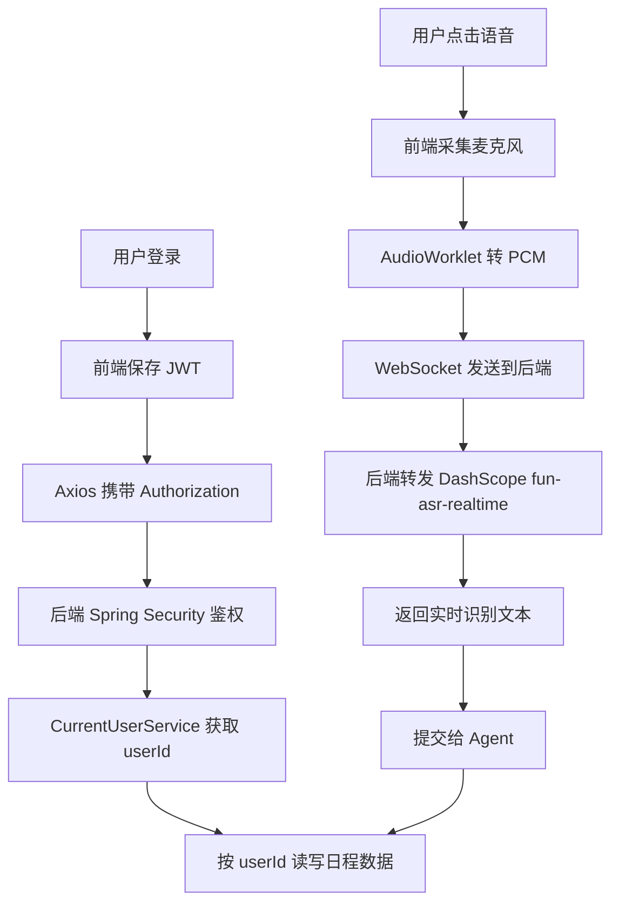
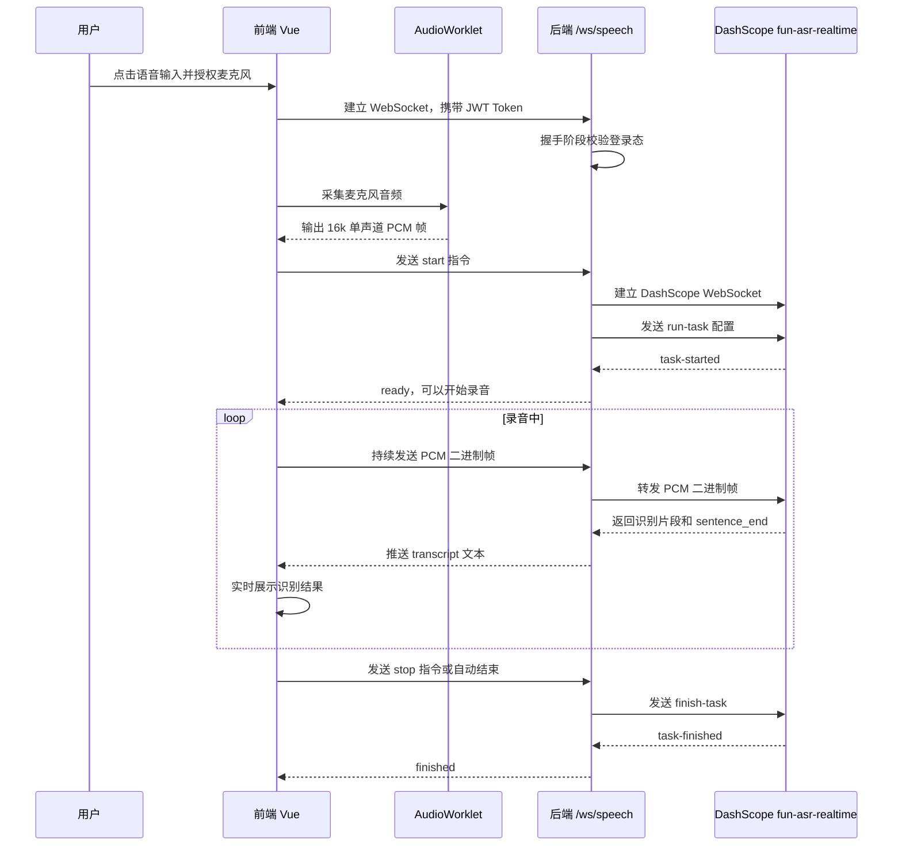

# Voice Calendar

## 视频demo地址

https://www.bilibili.com/video/BV12eVU6nEs1/

## 在线试用地址（服务器可能停止）

http://121.40.210.76/login


Voice Calendar 是一个语音版日历工具，支持用户登录、普通日程管理、重复日程规则管理、实时语音识别，以及基于大模型的自然语言日程操作。

项目核心目标是让用户可以直接说出“今天下午三点开会”“本周每天晚上背单词”“取消今天下午三点的会议”等指令，并由系统完成识别、理解、确认和执行。

## 技术栈

### 后端

| 技术 | 用途 |
|---|---|
| Java 21 | 后端主要开发语言 |
| Spring Boot 3.5 | 后端应用框架 |
| Spring Web | 提供 REST API |
| Spring WebSocket | 接收前端实时音频流 |
| Spring Security | 接口鉴权和登录态保护 |
| JJWT | JWT 生成与解析 |
| Spring Data JPA | 操作用户、普通日程、重复日程数据 |
| PostgreSQL | 业务数据持久化 |
| Spring AI Alibaba | 接入 DashScope 大模型 |
| DashScope `qwen-plus` | 默认聊天大模型，用于 Agent 意图解析、工具调用和 AI 助手回复 |
| DashScope `fun-asr-realtime` | 实时语音转文字 |
| H2 | 后端测试环境内存数据库 |

## 使用的大模型

| 模型 | 提供方 | 用途 | 默认配置项 |
|---|---|---|---|
| `qwen-plus` | 阿里云 DashScope / 百炼 | 语音 Agent 的意图解析、自动模式工具调用、AI 助手对话回复 | `SPRING_AI_DASHSCOPE_CHAT_OPTIONS_MODEL=qwen-plus` |
| `fun-asr-realtime` | 阿里云 DashScope / 百炼 | 实时语音识别，将前端 PCM 音频流转成文字 | `VOICE_CALENDAR_SPEECH_MODEL=fun-asr-realtime` |

这两个模型都通过 DashScope API Key 调用。实际使用时可以在 `backend/.env` 中调整模型名称。

### 前端

| 技术 | 用途 |
|---|---|
| Vue 3 | 前端 UI 框架 |
| TypeScript | 类型约束 |
| Vite | 开发服务和构建工具 |
| Vue Router | 登录页和日历页路由 |
| Pinia | 登录、日历、语音、Agent、AI 助手状态管理 |
| Axios | HTTP 请求封装 |
| Web Audio API | 采集麦克风音频 |
| AudioWorklet | 生成 16k PCM 音频帧 |
| WebSocket | 实时传输语音音频帧和识别文本 |
| Fetch + SSE | AI 助手流式输出 |
| lucide-vue-next | 图标组件 |

## 核心功能

- 用户注册、登录、JWT 鉴权
- 用户日程数据隔离
- 普通日程新增、查询、编辑、删除
- 重复日程规则新增、查询、编辑、删除
- 日历视图展示普通日程和重复日程实例
- 普通日程蓝色边框、重复日程橙色边框区分
- 实时语音识别
- 语音输入手动确认模式
- 语音输入静音自动提交模式
- Agent 稳妥模式、自动模式、AI 助手模式
- Agent 待确认操作过期和用户隔离
- AI 助手流式聊天、语音输入和会话记忆

## 前后端交互总览



## 语音识别流式传输流程



## 语音提交两种模式对比

| 模式 | 入口表现 | 提交流程 | 是否可编辑文本 | 适合场景 |
|---|---|---|---|---|
| 手动确认模式 | 点击语音入口后打开语音弹窗 | 用户开始录音、停止录音、检查文本后手动发送给 Agent | 是 | 识别结果需要检查、指令较复杂、希望更稳妥 |
| 静音自动提交模式 | 点击语音入口后在页面下方显示识别条幅 | 前端录音并实时展示文本，DashScope 判断一句话结束后自动发送给 Agent | 否 | 快速说一句明确指令，例如“今天下午三点开会” |

语音提交模式只决定“识别出的文字什么时候发送给 Agent”，不决定 Agent 是否直接执行。是否确认执行由下面的 Agent 模式决定。

## Agent 三种模式对比

| 模式 | 入口 | 交互方式 | 执行策略 | 适合场景 |
|---|---|---|---|---|
| 稳妥模式 | 语音文本提交 | 非聊天，结果弹窗确认 | 先解析为待确认操作，用户确认后执行 | 多指令、重复日程、删除等需要确认的操作 |
| 自动模式 | 语音文本提交 | 非聊天，不追问 | 高置信度单次日程可直接执行；低置信度、重复日程、修改意图直接失败 | 快速添加明确的单次日程 |
| AI 助手模式 | 侧边悬浮助手 | 聊天式，流式输出 | 查询可直接返回；增删操作在聊天中等待用户确认 | 连续对话、上下文指代、复杂查询 |

当前三种模式都不支持语音修改日程。修改普通日程或重复日程请在页面中手动编辑，或者删除后重新创建。

## 详细技术文档

- [登录功能与用户信息隔离](docs/auth-user-isolation.md)
- [语音输入的两种模式](docs/speech-input-modes.md)
- [Agent 执行指令的三种模式](docs/agent-execution-modes.md)

历史方案和开发过程记录保存在 [docs/old](docs/old)。

## 项目结构

```text
Voice Calendar
├── backend                 Spring Boot 后端
│   ├── .env.example         后端环境变量模板
│   └── src
├── frontend                Vue 前端
│   ├── public/pcm-worklet.js
│   └── src
│       ├── api              Axios 与接口配置
│       ├── components       页面组件
│       ├── router           路由
│       ├── stores           Pinia 状态
│       ├── utils            工具函数
│       └── views            页面
├── docs                    技术文档
└── sql                     PostgreSQL 初始化脚本
```

## 快速启动

以下命令默认在项目根目录执行。

### 1. 环境要求

- Java 21
- Maven 3.9+
- Node.js 20+
- PostgreSQL 16+
- DashScope API Key：必填，用于 `qwen-plus` 和 `fun-asr-realtime`

启动后端前建议先确认 Java 版本：

```bash
java -version
```

如果本机安装了多个 Java，请确保当前终端的 `JAVA_HOME` 指向 JDK 21。

### 2. 准备数据库

如果本地没有 PostgreSQL，可以使用 Docker：

```bash
docker run -d \
  --name voice-calendar-postgres \
  -e POSTGRES_DB=voice_calendar \
  -e POSTGRES_USER=voice_calendar \
  -e POSTGRES_PASSWORD=123456 \
  -p 5432:5432 \
  postgres:16
```

执行初始化 SQL：

```bash
docker exec -i voice-calendar-postgres psql -U voice_calendar -d voice_calendar < sql/init.sql
```

Windows PowerShell：

```powershell
Get-Content .\sql\init.sql | docker exec -i voice-calendar-postgres psql -U voice_calendar -d voice_calendar
```

### 3. 配置后端

复制环境变量模板：

```bash
cp backend/.env.example backend/.env
```

Windows PowerShell：

```powershell
Copy-Item backend\.env.example backend\.env
```

然后编辑 `backend/.env`。快速启动默认开启 AI Agent 和语音识别，所以必须填写数据库连接和 DashScope API Key。

```properties
VOICE_CALENDAR_DB_URL=jdbc:postgresql://localhost:5432/voice_calendar
VOICE_CALENDAR_DB_USERNAME=voice_calendar
VOICE_CALENDAR_DB_PASSWORD=123456

VOICE_CALENDAR_AI_ENABLED=true
SPRING_AI_DASHSCOPE_ENABLED=true
SPRING_AI_DASHSCOPE_AGENT_ENABLED=true
SPRING_AI_DASHSCOPE_API_KEY=replace_with_your_dashscope_api_key
SPRING_AI_DASHSCOPE_CHAT_OPTIONS_MODEL=qwen-plus

VOICE_CALENDAR_SPEECH_ENABLED=true
VOICE_CALENDAR_SPEECH_API_KEY=replace_with_your_dashscope_api_key
VOICE_CALENDAR_SPEECH_MODEL=fun-asr-realtime
```

请把 `replace_with_your_dashscope_api_key` 替换成自己的 DashScope API Key。没有有效 Key 时，语音识别和 Agent 功能无法正常使用。

### 4. 启动后端

```bash
cd backend
mvn spring-boot:run
```

默认地址：

```text
http://localhost:8080
```

### 5. 启动前端

```bash
cd frontend
npm install
npm run dev
```

默认地址：

```text
http://localhost:5173
```

如果后端不是 `localhost:8080`，启动前端前设置：

```bash
VITE_API_BASE_URL=http://你的后端地址:8080 npm run dev
```

Windows PowerShell：

```powershell
$env:VITE_API_BASE_URL="http://你的后端地址:8080"
npm run dev
```

## 常用命令

后端测试：

```bash
cd backend
mvn test
```

前端构建检查：

```bash
cd frontend
npm run build
```

后端打包：

```bash
cd backend
mvn clean package -DskipTests
java -jar target/backend-0.0.1-SNAPSHOT.jar
```

前端打包：

```bash
cd frontend
npm install
npm run build
```

构建产物位于：

```text
frontend/dist
```

## 注意事项

- 不要提交 `backend/.env`，不要把 DashScope API Key、数据库密码、JWT 密钥提交到 GitHub。
- 语音识别需要浏览器允许麦克风权限。
- 自动模式不会直接创建或删除重复日程，遇到周期表达会提示切换稳妥模式。
- 重复日程以规则形式保存，不会展开成大量普通日程。
- 本项目使用 Java 21，运行 Maven 时请确认 `JAVA_HOME` 指向 JDK 21。
