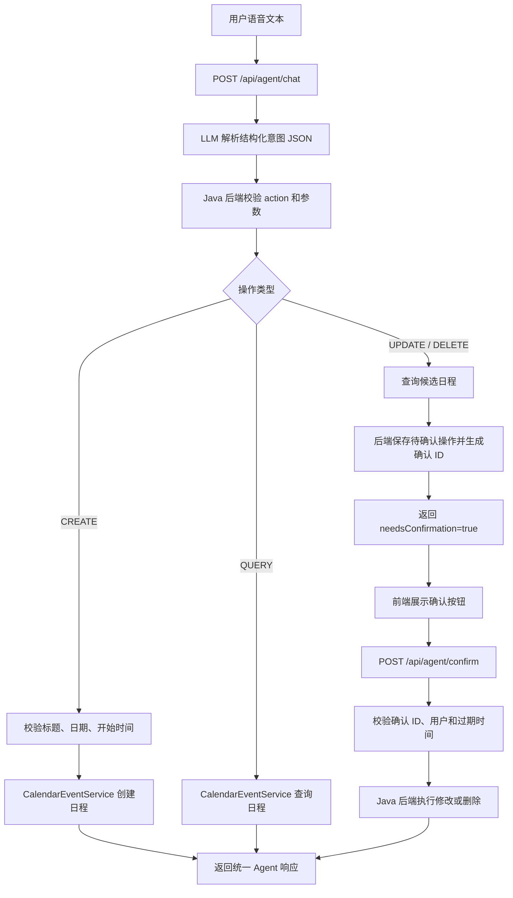
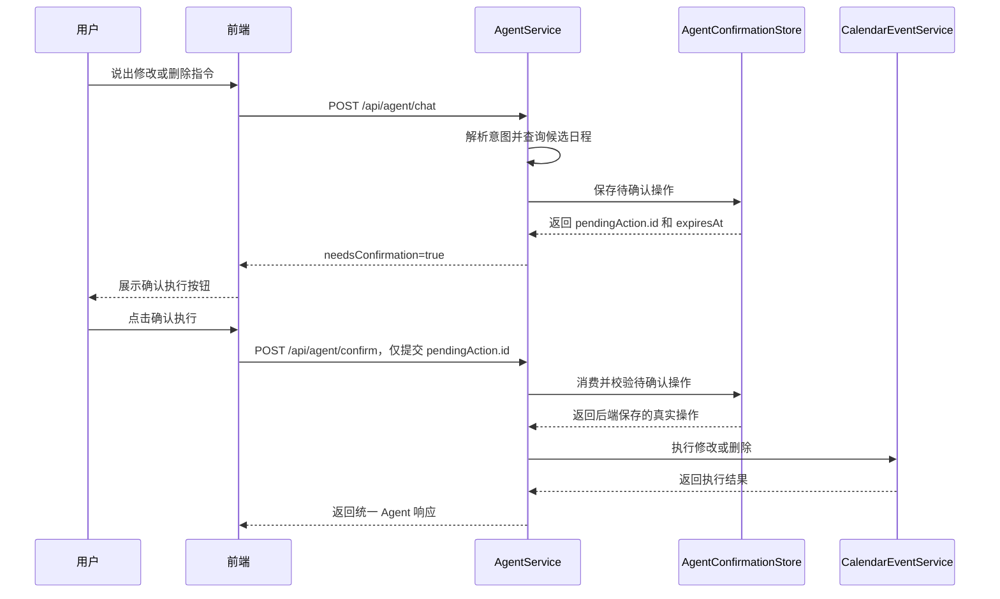
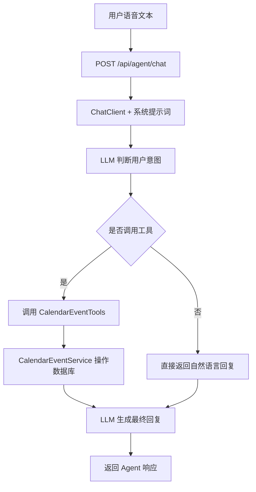

# Agent 执行模式说明

本文档说明 Voice Calendar 当前支持的两种 Agent 执行模式：稳妥模式和自动模式。

## 设计目标

语音日历的核心需求是通过自然语言完成日程管理。不同操作的风险不同：

- 查询日程风险低，可以直接执行。
- 创建日程风险中等，一般可以在信息完整时直接执行。
- 修改和删除日程风险较高，需要避免误改、误删。

因此系统保留两种模式：

- 稳妥模式：LLM 只负责理解用户意图，Java 后端负责审查和执行。
- 自动模式：LLM 通过 Function Calling / Tool Calling 直接决定是否调用工具。

默认推荐使用稳妥模式。

## 模式对比

| 对比项 | 稳妥模式 | 自动模式 |
|---|---|---|
| 模式标识 | `review` | `auto` |
| 默认状态 | 默认启用 | 手动切换 |
| LLM 职责 | 解析用户意图，输出结构化 JSON | 理解用户意图并直接决定调用工具 |
| 后端职责 | 校验意图、执行业务、控制风险 | 提供工具，接收模型调用结果 |
| 是否允许模型直接写数据库 | 不允许 | 允许 |
| 创建日程 | Java 校验后创建 | 模型调用创建工具 |
| 查询日程 | Java 根据意图查询 | 模型调用查询工具 |
| 修改日程 | 先返回候选和确认操作 | 模型可能直接调用修改工具 |
| 删除日程 | 必须确认后执行 | 模型可能直接调用删除工具 |
| 标签识别 | LLM 从固定标签中选择，后端只做合法性规范化 | LLM 调用工具时传入固定标签，后端只做合法性规范化 |
| 稳定性 | 更高 | 中等 |
| 灵活性 | 中等 | 更高 |
| 适用场景 | 正式使用、修改删除、需要可控结果 | 演示 AI 自动执行、快速验证 Function Calling |

## 稳妥模式流程

稳妥模式下，大模型不直接调用日程工具。它只把用户语音文本解析成结构化意图，后端根据意图决定是否执行。



稳妥模式的核心原则：

- LLM 只做理解，不做最终决策。
- Java 后端负责判断参数是否完整。
- 修改和删除必须经过后端生成的短期确认操作。
- 标签由 LLM 识别，但必须落在固定枚举中，识别不出来归类为“其他”。
- 所有结果都返回统一结构，方便前端展示。

## 标签枚举

日程标签不允许自由生成，当前固定为：

| 标签 | 典型语义 |
|---|---|
| `会议` | 开会、评审、讨论、汇报 |
| `工作` | 去工位、写代码、项目开发、办公 |
| `学习` | 上课、复习、考试、作业 |
| `生活` | 吃饭、购物、看病、取快递 |
| `运动` | 跑步、健身、打球 |
| `出行` | 出差、坐车、去机场、旅行 |
| `提醒` | 提醒我、记得、闹钟 |
| `其他` | 无法判断或不属于以上类别 |

标签识别策略：

- LLM 负责根据用户语音内容选择标签。
- 后端不做关键词兜底分类。
- 后端只做合法性规范化：如果标签为空或不在枚举中，就统一保存为 `其他`。
- 标签枚举定义在 `backend/src/main/java/com/cyx/backend/event/CalendarEventTag.java`。

当前代码实现：

- `CalendarEventTag` 定义固定标签枚举，并提供 `normalize` 方法。
- `CalendarEventService` 在创建和修改日程时调用标签规范化逻辑，保证入库标签一定属于固定枚举。
- `AgentService` 的稳妥模式提示词要求 LLM 在创建日程时必须输出 `tag`，并且只能从固定枚举中选择。
- `CalendarEventTools` 的工具参数说明要求自动模式也只能传入固定标签。
- 前端表单的标签占位提示同步展示固定标签范围，便于手动创建或编辑时保持一致。

示例：

| 用户表达 | 期望 LLM 输出标签 | 后端保存结果 |
|---|---|---|
| 今天下午三点开会 | `会议` | `会议` |
| 明天上午去工位 | `工作` | `工作` |
| 周六晚上跑步 | `运动` | `运动` |
| 记录一下买东西 | `生活` | `生活` |
| 无法判断类别的事项 | `其他` | `其他` |
| LLM 输出了不在枚举内的标签 | 任意非法值 | `其他` |

## 确认操作机制

修改和删除属于高风险操作。稳妥模式不会把完整操作内容交给前端长期保存，也不会信任前端直接提交的日程 id 和操作类型。

当前实现流程：



确认操作由 `backend/src/main/java/com/cyx/backend/service/AgentConfirmationStore.java` 保存在后端内存中。它会为每个待确认操作生成：

- `id`：确认操作 ID，前端确认时只提交这个值。
- `expiresAt`：过期时间。
- `userId`：当前登录用户，用于防止跨用户确认。
- 后端保存的真实操作内容：例如 `DELETE`、`UPDATE`、目标日程 id 和修改字段。

默认有效期为 2 分钟：

```properties
voice-calendar.agent.confirmation-ttl=PT2M
```

确认时后端会检查：

- 确认 ID 是否存在。
- 确认操作是否属于当前登录用户。
- 确认操作是否已经过期。
- 目标日程是否仍然存在。

如果确认操作不存在或已过期，后端会拒绝执行，并提示用户重新发起语音指令。

## 自动模式流程

自动模式保留原有 Function Calling / Tool Calling 链路。模型会根据系统提示词，自行决定是否调用日程工具。



自动模式的核心特点：

- 实现简单，响应链路短。
- 更能体现 LLM 自主调用工具的能力。
- 修改和删除存在误操作风险。
- 适合演示和低风险操作，不建议作为默认模式。

## 统一响应结构

两种模式都会返回统一 Agent 响应，前端根据字段展示结果。

主要字段：

| 字段 | 说明 |
|---|---|
| `content` | 给用户看的回复文本 |
| `aiEnabled` | 当前 AI 是否启用 |
| `success` | 本次操作是否成功 |
| `mode` | 当前执行模式，`review` 或 `auto` |
| `action` | 识别到的操作类型 |
| `needsConfirmation` | 是否需要用户确认 |
| `event` | 单个操作结果日程 |
| `candidates` | 候选日程列表 |
| `pendingAction` | 待确认操作，包含后端生成的确认 ID 和过期时间 |

`pendingAction` 当前主要字段：

| 字段 | 说明 |
|---|---|
| `id` | 后端生成的确认操作 ID |
| `expiresAt` | 确认操作过期时间 |
| `action` | 待执行操作，通常是 `UPDATE` 或 `DELETE` |
| `eventId` | 后端保存的目标日程 id |

前端确认时只提交：

```json
{
  "id": "pending-action-id"
}
```

## 当前建议

产品默认使用稳妥模式：

- 添加日程：信息完整时直接创建。
- 查询日程：直接查询。
- 修改日程：先定位候选日程，再确认执行。
- 删除日程：必须确认后执行。
- 标签：由 LLM 选择固定枚举标签，后端保证非法标签不会入库。

自动模式作为可选能力保留：

- 用于展示 Function Calling 效果。
- 用于开发阶段快速验证工具调用。
- 不作为高风险操作的默认入口。

## 后续优化方向

后续可以继续增强稳妥模式：

- 增加请求去重，避免重复添加同一日程。
- 将待确认操作从内存存储升级为 Redis 或数据库存储，支持多实例部署和服务重启后保留短期状态。
- 增加 Agent 操作日志，记录解析结果、候选项和最终执行结果。
- 增加更完整的语料测试集，验证不同口语表达下的稳定性。
- 根据用户时区解析“今天、明天、下周”等相对时间。
