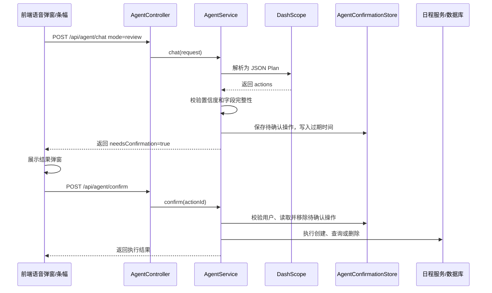
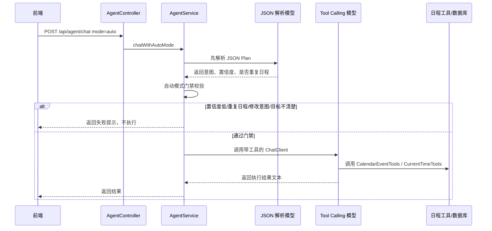
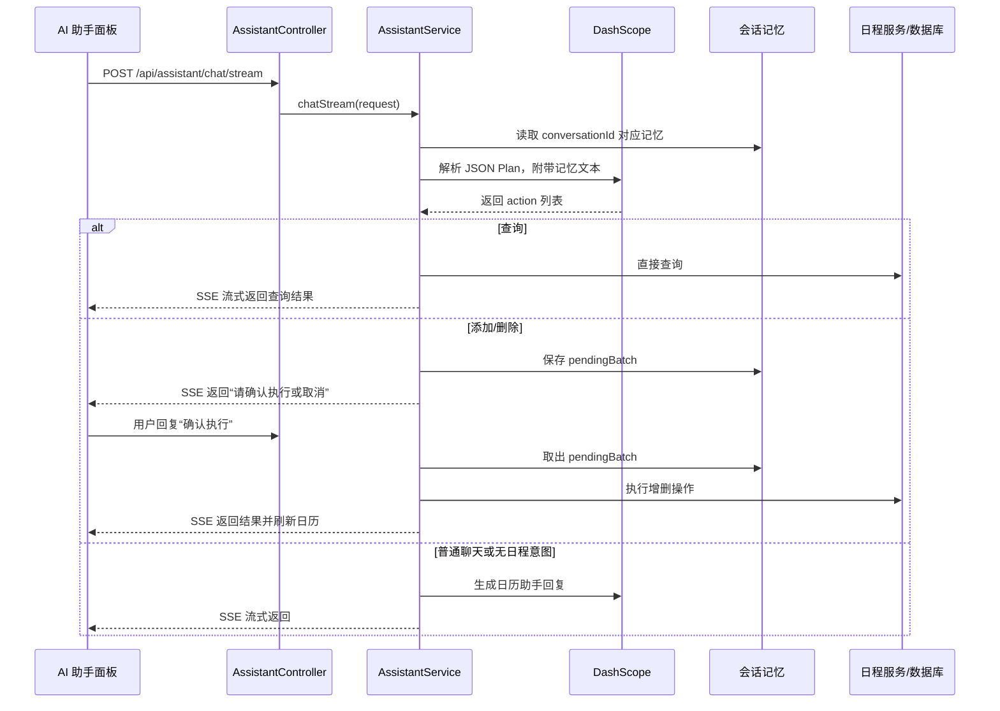

# Agent 执行指令的三种模式

## 1. 功能目标

本项目的 Agent 负责把自然语言转换为日程操作。当前保留三种模式：

1. 稳妥模式：语音识别后的文本先解析为待确认操作，用户确认后执行。
2. 自动模式：高置信度、低风险的语音指令直接执行，不确定就失败。
3. AI 助手模式：侧边聊天助手，支持流式对话、上下文记忆和聊天内确认。

三种模式共用日程服务和数据库隔离，但入口、风险控制和交互方式不同。

## 2. 使用技术

| 层级 | 技术 | 作用 |
|---|---|---|
| 后端 AI | Spring AI Alibaba | 接入 DashScope 大模型 |
| 后端 AI | DashScope Chat Model | 进行自然语言意图解析和回复生成 |
| 后端 | ChatClient | 构建不同模式的系统提示词和调用流程 |
| 后端 | JSON Plan | 让模型先输出结构化日程计划 |
| 后端 | Spring AI Tool Calling | 自动模式中让模型调用日程工具 |
| 后端 | AgentConfirmationStore | 保存待确认操作，支持过期和用户隔离 |
| 后端 | SseEmitter | AI 助手流式输出 |
| 前端 | Pinia | 管理语音 Agent 状态、待确认操作和助手聊天状态 |
| 前端 | Fetch SSE | 读取 AI 助手流式响应 |
| 数据库 | PostgreSQL | 保存普通日程和重复日程规则 |

## 3. 三种模式总览

| 模式 | 前端入口 | 后端入口 | 是否对话 | 是否直接执行 | 确认方式 | 适合场景 |
|---|---|---|---|---|---|---|
| 稳妥模式 | 语音文本提交 | `POST /api/agent/chat`，`mode=review` | 否 | 否 | 结果弹窗确认 | 多指令、重复日程、删除等需要确认的操作 |
| 自动模式 | 语音文本提交 | `POST /api/agent/chat`，`mode=auto` | 否 | 是，高置信度才执行 | 不确认，失败则提示 | 快速添加明确的单次日程 |
| AI 助手模式 | 侧边悬浮助手 | `POST /api/assistant/chat/stream` | 是 | 查询可直接返回，增删需聊天确认 | 用户回复“确认执行” | 连续对话、查询、上下文指代 |

## 4. 稳妥模式

### 4.1 设计目标

稳妥模式优先保证安全，不让模型直接改数据库。它只让模型解析意图，真正执行前必须由用户确认。

### 4.2 执行流程



### 4.3 支持能力

稳妥模式支持：

- 添加普通日程
- 删除普通日程
- 查询日程
- 添加重复日程规则
- 删除整条重复日程规则
- 一句话多条普通日程指令

当前明确不支持：

- 修改普通日程
- 修改重复日程规则

用户表达修改意图时，后端会返回“不支持修改，请手动编辑或删除后重建”。

### 4.4 风险控制

- 模型只输出 JSON，不直接调用数据库工具。
- 增删查操作都会先进入待确认状态。
- 待确认操作保存在内存 `AgentConfirmationStore` 中。
- 待确认操作默认 2 分钟过期，配置项为 `VOICE_CALENDAR_AGENT_CONFIRMATION_TTL=PT2M`。
- 待确认操作绑定 `userId`，用户不能确认别人的操作。
- 删除目标不唯一时不展示候选，不让用户靠模型猜。
- 对“刚刚、最近、那个、它”等上下文指代保持严格，不在语音稳妥模式里用记忆猜测目标。

## 5. 自动模式

### 5.1 设计目标

自动模式是语音快捷入口，目标是“能做就直接做，不能做就失败”，不和用户聊天、不追问、不展示候选。

### 5.2 执行流程



### 5.3 自动模式门禁

自动模式在真正让模型调用工具前，会先做一轮结构化解析和校验：

- 整体置信度必须达到 `VOICE_CALENDAR_AGENT_AUTO_CONFIDENCE_THRESHOLD`，默认 `0.8`。
- 每条 action 的置信度也必须达标。
- 检测到重复日程时直接拒绝，要求切换稳妥模式确认。
- 检测到修改意图时直接返回不支持。
- 未识别到明确日程管理信息时直接失败。

### 5.4 工具能力

自动模式可用工具来自 `CalendarEventTools` 和 `CurrentTimeTools`：

- `getCurrentDateTime`：把“今天、明天、下周一”等相对时间换算为具体日期。
- `createCalendarEvent`：创建普通单次日程。
- `listCalendarEvents`：查询日程。
- `getCalendarEvent`：内部按 id 查询日程。
- `deleteCalendarEvent`：删除明确 id 的普通日程。
- `createRecurringEvent`：工具存在，但自动模式门禁会拦截周期日程，避免误创建。

### 5.5 输出限制

自动模式的提示词要求：

- 不闲聊。
- 不追问。
- 不输出内部 id。
- 不根据“刚刚、最近、那个”等模糊指代猜测目标。
- 不确定就返回失败提示。

## 6. AI 助手模式

### 6.1 设计目标

AI 助手是独立于前两个语音 Agent 模式的新 Agent。它是聊天式入口，适合用户边问边操作日程。

### 6.2 前端交互

- 页面侧边有悬浮圆形按钮。
- 打开后显示聊天面板，不大面积遮挡主日历。
- 支持文字输入。
- 支持语音输入，语音结果填入聊天输入框。
- 后端使用 SSE 流式返回，前端按片段追加显示。

### 6.3 执行流程



### 6.4 记忆机制

AI 助手使用后端内存 Map 保存会话上下文，key 为：

```text
userId:conversationId
```

记忆内容包括：

- 最近 12 条对话摘要。
- 最近查询结果。
- 最近操作的普通日程。
- 最近操作的重复日程。
- 等待用户确认的 pending batch。

因此在 AI 助手模式中，类似“删除我刚刚设置的日程”可以结合最近操作记录定位目标。这个能力只属于 AI 助手模式，不用于自动模式和稳妥模式。

### 6.5 确认方式

AI 助手不使用弹窗确认，而是在聊天中等待用户回复：

- 确认类：`确认`、`执行`、`可以`、`好的`、`yes`、`y`
- 取消类：`取消`、`不要`、`算了`、`不用`、`no`、`n`

如果存在待确认操作，用户没有明确确认或取消，助手会继续提示用户选择确认或取消。

## 7. 重复日程处理

项目对重复日程做了专门设计，避免“今年每天背单词”被展开成几百条普通日程。

### 7.1 存储方式

重复日程只保存一条规则：

- `start_date`
- `end_date`
- `start_time`
- `end_time`
- `recurrence_type`
- `interval_value`
- `days_of_week`

查询日历时再动态展开为当天实例。

### 7.2 Agent 处理方式

- 稳妥模式：可以创建或删除整条重复规则，但必须确认。
- 自动模式：检测到重复日程直接拒绝执行。
- AI 助手模式：可以创建或删除整条重复规则，但要在聊天中确认。

### 7.3 当前限制

- 不支持无限重复，必须有结束日期。
- 后端限制重复范围，避免一次创建过大的规则。
- 当前不支持修改重复规则，只支持手动表单编辑、删除后重建。

## 8. 做过的优化

### 8.1 三种模式职责拆分

自动模式负责快捷、稳妥模式负责安全、AI 助手负责对话和记忆，避免一个 Agent 同时承担所有交互形态导致提示词复杂失控。

### 8.2 自动模式先审查再工具调用

自动模式不是完全放任模型调工具，而是先用 JSON Plan 做门禁，通过后才进入工具调用。

### 8.3 稳妥模式统一待确认格式

无论单条还是多条指令，前端都按 `needsConfirmation`、`pendingAction`、`pendingRecurringAction` 和 `results` 展示，方便用户逐条确认或取消。

### 8.4 置信度阈值分级

- 稳妥模式默认阈值：`0.45`
- 自动模式默认阈值：`0.8`
- AI 助手默认阈值：`0.30`

阈值越高越保守。自动模式最高，因为它可能直接执行。

### 8.5 更新操作暂时下线

语音修改日程不稳定，容易把“修改”误判成“删除 + 新建”。当前三种模式都明确返回不支持修改，引导用户手动编辑或删除后重建。

### 8.6 50 字输入上限

`AgentChatRequest` 和 `AssistantChatRequest` 都限制 `message` 最多 50 字，前端也同步限制，降低误输入、长文本和恶意调用造成的模型消耗。

### 8.7 不向用户暴露内部 id

Agent 回复只展示标题、日期、时间、地点、标签、提醒等用户关心的信息，不展示数据库 id、pendingAction id、createdAt、updatedAt。

## 9. 当前配置项

```properties
VOICE_CALENDAR_AI_ENABLED=true
SPRING_AI_DASHSCOPE_ENABLED=true
SPRING_AI_DASHSCOPE_API_KEY=你的 DashScope Key
SPRING_AI_DASHSCOPE_CHAT_OPTIONS_MODEL=qwen-plus
SPRING_AI_DASHSCOPE_CHAT_OPTIONS_TEMPERATURE=0.2

VOICE_CALENDAR_AGENT_TIME_ZONE=Asia/Shanghai
VOICE_CALENDAR_AGENT_CONFIRMATION_TTL=PT2M
VOICE_CALENDAR_AGENT_REVIEW_CONFIDENCE_THRESHOLD=0.45
VOICE_CALENDAR_AGENT_AUTO_CONFIDENCE_THRESHOLD=0.8
VOICE_CALENDAR_ASSISTANT_TIME_ZONE=Asia/Shanghai
VOICE_CALENDAR_ASSISTANT_CONFIDENCE_THRESHOLD=0.30
```

## 10. 验证方式

1. 稳妥模式说“今天下午三点开会”，应返回待确认操作，确认后才创建。
2. 稳妥模式说“三点背单词，五点学数学”，应拆成多条待确认操作。
3. 自动模式说“今天下午三点开会”，高置信度时应直接创建。
4. 自动模式说“本周每天晚上背单词”，应拒绝并提示切换稳妥模式。
5. 任意模式说“把会议改到明天”，应提示当前不支持修改。
6. AI 助手中添加一个日程后，再说“删除刚刚设置的日程”，应基于记忆生成确认请求。
7. 不登录调用 Agent 或助手接口，应返回 `401`。
