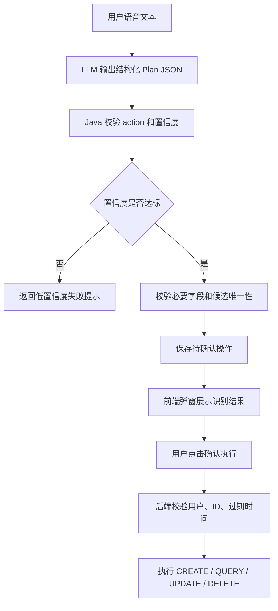
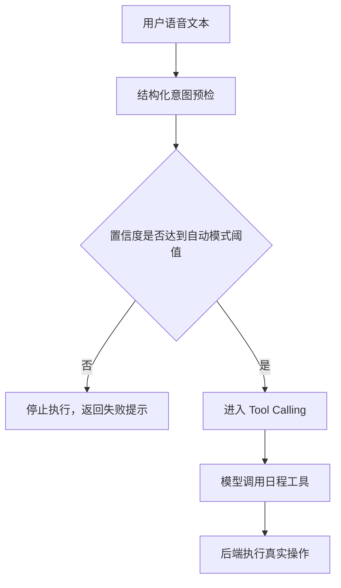

# Agent 用户意图理解优化记录

## 背景

Voice Calendar 的 Agent 目标不是做通用聊天，而是把用户的自然语言或语音文本稳定转换成日程管理操作。

在项目早期，Agent 已经可以处理比较标准的表达：

- 今天下午三点开会
- 明天上午九点背单词
- 查看今天的日程

但真实语音输入往往更口语化。用户不会总是说“删除某个日程”，而是会说“取消会议”“今天下午不背单词了”“明天不用上课了”。这些表达对人来说很清楚，但如果后端提示词、结构化字段和执行规则设计得太窄，就容易被模型判成无效意图，或者因为目标定位不稳定而拒绝执行。

本文记录本项目对用户意图理解能力的优化历程。

## 初始方案

早期 Agent 分为两种执行模式：

| 模式 | 主要特点 |
|---|---|
| 审查模式 | LLM 解析意图，Java 后端校验并执行高风险操作 |
| 自动模式 | LLM 通过 Tool Calling 直接调用日程工具 |

审查模式的核心链路是：

```text
用户文本
-> LLM 输出 CalendarAgentIntent
-> Java 后端根据 action 执行 CREATE / QUERY / UPDATE / DELETE
-> 修改和删除需要确认
```

这个方案比完全交给 LLM 更可控，但它仍然依赖模型能准确输出 `action`、日期、时间、标题关键词等字段。

## 第一次问题：创建日程过度追问

### 现象

用户说：

```text
今天下午三点开会
```

模型有时会追问“会议主题是什么”，而不是直接创建日程。

### 原因

模型默认会追求“信息完整”，但语音日历工具的实际需求是快速记录。

对日程创建来说，只要有日期、开始时间和日程内容，就可以先创建；主题、地点、备注、结束时间都应该是可选字段。

### 优化

在提示词中明确：

- “今天下午三点开会”的标题就是“开会”。
- 创建日程时不要因为缺少非关键字段而追问。
- 标签从固定枚举中选择，识别不出来归为“其他”。

### 结果

创建类表达变得更顺滑，用户不需要为了简单日程补充过多信息。

## 第二次问题：取消会议识别不稳定

### 现象

用户说：

```text
取消今天下午三点的会议
```

系统可能无法正确识别为删除日程。

### 原因

当时提示词只明确写了“删除”，没有明确告诉模型“取消、撤销、不去了、不参加”也属于删除意图。

同时，候选日程匹配逻辑过于机械：如果用户说“会议”，但日程标题是“开会”，简单的字符串包含匹配不一定能匹配成功。

### 优化

后端做了两层调整：

- 提示词明确把“取消、撤销、删掉、移除、不去了、不参加、作废”归为 `DELETE`。
- 候选日程匹配增加会议类同义表达，例如“会议、开会、例会、讨论、评审、汇报”可以互相匹配。

### 结果

“取消今天下午三点的会议”可以稳定进入删除流程。

在审查模式下，它会生成待确认删除操作；在自动模式下，只有能唯一定位时才执行，否则返回失败提示。

## 第三次问题：否定句也是取消意图

### 现象

用户说：

```text
今天下午不背单词了
```

系统仍然可能识别不出来。

### 原因

这是一个典型的中文口语表达。它没有出现“删除”或“取消”，但语义上是“取消今天下午背单词这个日程”。

如果继续只靠枚举关键词，就需要不断补充类似说法：

- 不背单词了
- 不学数学了
- 不用上课了
- 今天不跑步了

这种方式会越来越难维护。

### 优化

提示词从“关键词枚举”升级为“语义规则”：

```text
用户表达不再执行某个已经安排的动作，或用否定句取消某个日程，本质是 DELETE。
```

同时在结构化意图中新增时间段定位字段：

| 字段 | 作用 |
|---|---|
| `targetStartTimeFrom` | 目标日程开始时间下界 |
| `targetStartTimeTo` | 目标日程开始时间上界 |

例如：

```text
今天下午不背单词了
```

应解析为：

```text
action = DELETE
date = 今天
targetTitleKeyword = 背单词
targetStartTimeFrom = 12:00
targetStartTimeTo = 18:00
```

后端再用日期、标题关键词、时间段共同筛选候选日程。

### 结果

系统不再只依赖“删除/取消”这类显式动词，而是能理解更多自然口语中的取消意图。

## 第四次优化：引入置信度阈值

### 问题反思

单纯依靠提示词会遇到两个问题：

- 提示词越写越长，仍然无法覆盖所有自然语言表达。
- 提示词过严会漏识别，提示词过松又可能误操作。

因此需要把模型能力和后端规则结合起来：

```text
LLM 负责理解语义并输出结构化结果
Java 后端负责审查置信度、参数完整性、候选唯一性和执行风险
```

### 当前方案

后端增加两套置信度阈值：

| 模式 | 配置项 | 默认值 | 设计目的 |
|---|---|---:|---|
| 审查模式 | `voice-calendar.agent.review-confidence-threshold` | `0.45` | 阈值较低，允许用户看到待确认结果 |
| 自动模式 | `voice-calendar.agent.auto-confidence-threshold` | `0.8` | 阈值较高，避免低置信度自动执行 |

审查模式阈值较低，是因为用户还会看到确认弹窗，可以人工兜底。

自动模式阈值较高，是因为它可能直接调用工具，误操作成本更高。

## 第五次优化：审查模式所有操作都需要确认

### 之前的行为

审查模式中：

- `CREATE` 和 `QUERY` 会直接执行。
- `UPDATE` 和 `DELETE` 会生成待确认操作。

### 新问题

如果用户希望审查模式真正“稳妥”，那所有操作都应该先确认。

即使创建和查询风险较低，也应该保持一致的交互模型：

```text
识别结果
-> 弹窗展示即将执行的操作
-> 用户确认
-> 后端执行
```

### 当前行为

审查模式中所有操作都生成待确认操作：

| 操作 | 当前审查模式行为 |
|---|---|
| `CREATE` | 生成待确认创建操作，确认后写入数据库 |
| `QUERY` | 生成待确认查询操作，确认后返回查询结果 |
| `UPDATE` | 生成待确认修改操作，确认后修改数据库 |
| `DELETE` | 生成待确认删除操作，确认后删除数据库 |

确认操作仍然会校验：

- 当前登录用户
- 待确认操作 ID
- 操作是否过期
- 修改/删除目标是否存在

## 当前整体流程

### 审查模式



### 自动模式



## 核心经验

### 1. 不要只靠枚举提示词

枚举可以解决短期问题，但不能作为长期方案。

更好的方式是抽象出语义规则：

```text
不再执行某个已安排动作 = 取消该日程 = DELETE
```

这样可以覆盖更多口语表达。

### 2. LLM 输出意图，后端负责审查

模型适合做语义理解，但不适合独自承担所有执行风险。

后端必须负责：

- 置信度阈值
- 参数完整性
- 用户隔离
- 候选唯一性
- 确认操作过期
- 高风险操作执行控制

### 3. 审查模式和自动模式应该有不同风险策略

审查模式有人类确认，可以更宽松。

自动模式可能直接执行，必须更严格。

### 4. 候选匹配不能只做字符串包含

真实语言有大量同义表达：

- 会议 / 开会 / 例会
- 背单词 / 学英语 / 复习英语
- 上课 / 听课 / 课程

当前已先实现会议类同义匹配，后续可以继续把学习、运动、出行等类别扩展成更系统的语义匹配表。

## 当前实现文件

| 文件 | 作用 |
|---|---|
| `backend/src/main/java/com/cyx/backend/service/AgentService.java` | 意图解析、置信度阈值、待确认操作、候选匹配 |
| `backend/src/main/java/com/cyx/backend/config/AgentConfig.java` | 自动模式系统提示词和工具调用规则 |
| `backend/src/main/java/com/cyx/backend/dto/CalendarAgentIntent.java` | 结构化意图字段，包含时间段定位 |
| `backend/src/main/java/com/cyx/backend/tool/CalendarEventTools.java` | 自动模式可调用的日程工具描述 |
| `backend/src/main/resources/application.properties` | Agent 阈值和确认过期时间配置 |
| `backend/src/test/java/com/cyx/backend/controller/AgentControllerTests.java` | 待确认创建、查询、删除等链路测试 |

## 后续可优化方向

- 增加学习、运动、出行、工作等类别的同义词匹配。
- 把候选匹配从硬编码关键词升级为可配置词典。
- 在前端确认弹窗中展示模型置信度，帮助用户理解为什么需要确认。
- 增加低置信度样本日志，后续用于持续优化提示词和匹配规则。
- 为自动模式增加更强的后端执行前校验，而不是完全依赖 Tool Calling 的结果。

