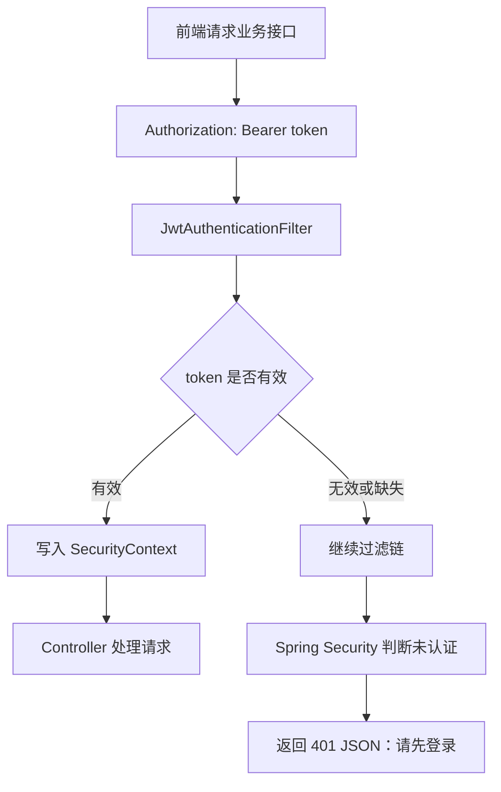
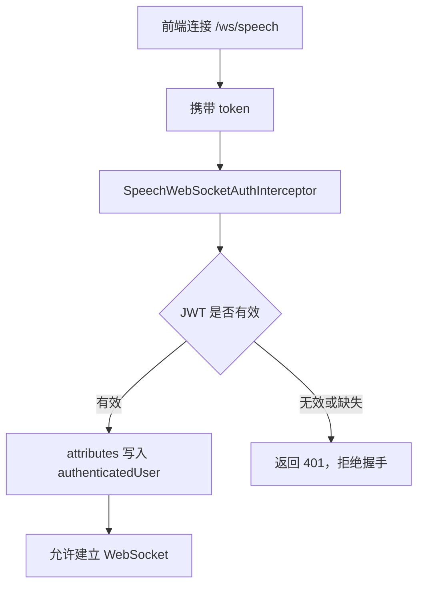

# 登录鉴权与用户数据隔离技术文档

## 背景

Voice Calendar 当前已经支持用户注册、登录、登录态恢复、退出登录，以及按用户隔离日程数据。该能力的目标是：

- 每个用户只能看到和操作自己的日程。
- 未登录用户不能调用日程、Agent 等需要消耗资源或修改数据的接口。
- 语音识别 WebSocket 也必须经过登录校验，避免未登录用户直接消耗语音识别额度。
- 前端在登录过期后能自动清理本地状态并回到登录页。

当前鉴权方案采用：

```text
Vue 3 前端
+ localStorage 保存 JWT
+ Spring Security 无状态鉴权
+ JJWT 生成和解析 token
+ BCrypt 保存密码哈希
+ PostgreSQL 保存用户和日程数据
```

## 核心文件

| 文件 | 职责 |
|---|---|
| `frontend/src/App.vue` | 登录/注册表单、token 存储、请求附带 Authorization、401 后清理登录态 |
| `backend/src/main/java/com/cyx/backend/controller/AuthController.java` | 暴露注册、登录、当前用户接口 |
| `backend/src/main/java/com/cyx/backend/service/AuthService.java` | 用户注册、密码校验、返回 token 和用户资料 |
| `backend/src/main/java/com/cyx/backend/security/JwtService.java` | JWT 生成和解析 |
| `backend/src/main/java/com/cyx/backend/security/JwtAuthenticationFilter.java` | 从 HTTP 请求头解析 Bearer Token，并写入 Spring Security 上下文 |
| `backend/src/main/java/com/cyx/backend/config/SecurityConfig.java` | 配置无状态鉴权、放行接口、未登录响应 |
| `backend/src/main/java/com/cyx/backend/service/CurrentUserService.java` | 从 SecurityContext 中获取当前登录用户 |
| `backend/src/main/java/com/cyx/backend/security/SpeechWebSocketAuthInterceptor.java` | 语音 WebSocket 握手鉴权 |
| `backend/src/main/java/com/cyx/backend/service/CalendarEventService.java` | 所有日程查询和写入都绑定 userId |
| `backend/src/main/java/com/cyx/backend/repository/CalendarEventJpaRepository.java` | 所有关键查询方法都带 userId 条件 |

## 数据模型

### app_users

用户表对应 `UserEntity`。

| 字段 | 说明 |
|---|---|
| `id` | 用户主键 |
| `username` | 用户名，唯一 |
| `password_hash` | BCrypt 密码哈希 |
| `display_name` | 昵称，可为空 |
| `created_at` | 创建时间 |
| `updated_at` | 更新时间 |

约束：

- `username` 唯一。
- 注册时会统一做 `trim` 和小写化处理，避免 `Demo` 和 `demo` 被当作两个用户。
- 密码不明文保存，只保存 BCrypt 哈希。

### calendar_events

日程表对应 `CalendarEventEntity`。

| 字段 | 说明 |
|---|---|
| `id` | 日程主键 |
| `user_id` | 日程所属用户 |
| `title` | 日程标题 |
| `start_time` | 开始时间 |
| `end_time` | 结束时间 |
| `location` | 地点 |
| `description` | 备注 |
| `tag` | 标签 |
| `reminder_time` | 提醒时间 |
| `created_at` | 创建时间 |
| `updated_at` | 更新时间 |

隔离核心字段是 `user_id`。

当前 `user_id` 字段没有强制非空，主要是为了兼容早期未加用户系统时产生的旧数据。项目启动时 `DemoDataInitializer` 会把 `user_id is null` 的历史日程迁移给 `demo` 用户。业务服务层创建新日程时都会写入当前登录用户 ID。

## 前端登录流程

### 注册

用户在前端选择注册模式，输入用户名、密码和可选昵称。

```text
用户提交注册表单
-> POST /api/auth/register
-> 后端创建用户并返回 token + user
-> 前端保存 token 到 localStorage
-> 前端保存 currentUser
-> 加载当前用户日程
-> 进入日历主界面
```

### 登录

```text
用户提交登录表单
-> POST /api/auth/login
-> 后端校验用户名和密码
-> 校验通过后返回 token + user
-> 前端保存 token 到 localStorage
-> 前端保存 currentUser
-> 加载当前用户日程
-> 进入日历主界面
```

### 登录态恢复

前端启动时会读取：

```text
localStorage["voice-calendar-token"]
```

如果存在 token，则执行：

```text
GET /api/auth/me
```

请求成功：

```text
恢复 currentUser
-> 加载 /api/events
-> 显示日历主界面
```

请求失败或 token 过期：

```text
清理 token
-> 清空 currentUser 和 events
-> 回到登录页
```

### 退出登录

前端退出登录只做本地状态清理：

```text
删除 localStorage token
currentUser = null
events = []
关闭表单和语音弹窗
回到登录页
```

当前后端没有维护服务端 session，也没有 token 黑名单，因此退出登录不会让已签发 token 在服务端立即失效。token 会在过期时间后自然失效。

## 后端认证接口

### POST /api/auth/register

请求参数：

| 字段 | 说明 |
|---|---|
| `username` | 必填，3 到 30 位，只允许字母、数字、下划线 |
| `password` | 必填，6 到 72 位 |
| `displayName` | 可选，最多 30 个字符 |

处理流程：

```text
校验请求参数
-> username trim + lowerCase
-> 检查 username 是否已存在
-> BCrypt 加密密码
-> 保存 UserEntity
-> 生成 JWT
-> 返回 AuthResponse
```

返回结构：

```json
{
  "token": "jwt-token",
  "user": {
    "id": 1,
    "username": "demo",
    "displayName": "演示用户",
    "createdAt": "2026-05-30T00:00:00Z"
  }
}
```

### POST /api/auth/login

请求参数：

| 字段 | 说明 |
|---|---|
| `username` | 必填 |
| `password` | 必填 |

处理流程：

```text
username trim + lowerCase
-> 根据 username 查询用户
-> BCrypt matches 校验密码
-> 生成 JWT
-> 返回 AuthResponse
```

用户名不存在或密码错误时，统一返回“用户名或密码错误”，避免暴露哪个字段存在。

### GET /api/auth/me

需要登录。

处理流程：

```text
JwtAuthenticationFilter 解析 token
-> CurrentUserService 获取当前用户 ID
-> AuthService 根据 userId 查询用户资料
-> 返回 UserProfile
```

## JWT 设计

JWT 由 `JwtService` 负责生成和解析。

生成 token 时包含：

| 字段 | 说明 |
|---|---|
| `sub` | 用户名 |
| `uid` | 用户 ID |
| `iat` | 签发时间 |
| `exp` | 过期时间 |

签名密钥来自配置：

```properties
voice-calendar.auth.jwt-secret=...
voice-calendar.auth.token-ttl=PT24H
```

当前默认 token 有效期是 24 小时。

解析 token 时：

```text
校验签名
-> 校验过期时间
-> 读取 uid 和 sub
-> 构造 AuthenticatedUser
```

如果 token 无效、过期、签名错误或字段缺失，解析结果为 `null`。

## Spring Security 鉴权流程

当前后端采用无状态认证：

```text
SessionCreationPolicy.STATELESS
禁用 CSRF
禁用 httpBasic
禁用 formLogin
禁用 logout
```

请求放行规则：

| 路径 | 是否需要登录 | 原因 |
|---|---|---|
| `OPTIONS /**` | 不需要 | CORS 预检 |
| `/api/auth/**` | 不需要 | 注册、登录入口 |
| `/api/speech/config` | 不需要 | 前端读取语音配置展示状态 |
| `/ws/speech` | Spring Security 放行，但 WebSocket 拦截器单独鉴权 | WebSocket 握手不走普通 REST 认证流程 |
| 其他接口 | 需要 | 日程、Agent 等业务接口 |

HTTP 请求鉴权流程：



未登录访问受保护接口时，后端统一返回 401：

```json
{
  "status": 401,
  "message": "请先登录",
  "details": []
}
```

前端 `authorizedFetch` 收到 401 后会清理本地登录态，并提示“登录已过期，请重新登录”。

## 当前用户上下文

`JwtAuthenticationFilter` 解析 token 后，会把当前用户写入：

```text
SecurityContextHolder.getContext().setAuthentication(...)
```

其中 principal 是：

```java
AuthenticatedUser(id, username)
```

业务层不直接解析 token，而是通过 `CurrentUserService` 读取当前登录用户：

```text
CurrentUserService.requireCurrentUserId()
```

这样可以让 Controller、Agent、Tool 调用统一使用同一套用户上下文。

## 日程数据隔离

日程数据隔离的核心原则：

```text
所有日程读写操作都必须带 currentUserId
```

### Controller 层

`CalendarEventController` 中所有接口都会先获取当前登录用户 ID：

```text
currentUserService.requireCurrentUserId()
```

然后传给 `CalendarEventService`。

例如：

```text
GET /api/events
-> eventService.findEvents(currentUserId, date)

POST /api/events
-> eventService.createEvent(currentUserId, request)

PUT /api/events/{id}
-> eventService.updateEvent(currentUserId, id, request)

DELETE /api/events/{id}
-> eventService.deleteEvent(currentUserId, id)
```

### Service 层

`CalendarEventService` 不提供不带 userId 的业务方法。

创建日程：

```text
保存 CalendarEventEntity 时写入 userId
```

查询日程：

```text
findAllByUserIdOrderByStartTimeAsc(userId)
findEventsOnDate(userId, dayStart, nextDayStart)
```

查看单条日程：

```text
findByIdAndUserId(id, userId)
```

更新日程：

```text
先 findByIdAndUserId(id, userId)
再保存更新后的数据
```

删除日程：

```text
existsByIdAndUserId(id, userId)
deleteByIdAndUserId(id, userId)
```

因此，即使用户知道另一个用户的日程 ID，也无法通过接口读取、修改或删除该日程。

### Repository 层

`CalendarEventJpaRepository` 中关键方法都包含 `userId` 条件：

| 方法 | 隔离作用 |
|---|---|
| `findAllByUserIdOrderByStartTimeAsc` | 只查当前用户所有日程 |
| `findByIdAndUserId` | 只允许获取当前用户名下的指定日程 |
| `existsByIdAndUserId` | 删除前校验日程归属 |
| `deleteByIdAndUserId` | 只删除当前用户名下的指定日程 |
| `findEventsOnDate` | 按日期查询时也必须匹配 userId |

## Agent 用户隔离

Agent 相关接口同样依赖当前登录用户。

### Agent Chat

`AgentService.chat()` 会先调用：

```text
currentUserService.requireCurrentUserId()
```

然后所有日程操作都基于该 userId：

```text
createEvent(userId, intent, mode)
queryEvents(userId, intent, mode)
prepareUpdate(userId, intent, mode)
prepareDelete(userId, intent, mode)
```

### Tool Calling

自动模式下，LLM 会调用 `CalendarEventTools`。

这些 Tool 方法内部也会调用：

```text
currentUserService.requireCurrentUserId()
```

也就是说，即使是模型通过 Function Calling 调工具，也只能操作当前登录用户的数据。

### 待确认操作隔离

稳妥模式下，修改和删除会先生成待确认操作。

`AgentConfirmationStore` 保存待确认操作时会同时保存：

```text
userId + pendingAction
```

确认执行时必须满足：

```text
确认 ID 存在
确认 ID 未过期
确认 ID 属于当前用户
```

如果另一个用户拿到了确认 ID，也无法执行该确认操作。

## 语音 WebSocket 鉴权

语音识别接口是 WebSocket：

```text
ws://localhost:8080/ws/speech
```

由于 WebSocket 握手和普通 REST 请求不同，项目中单独使用 `SpeechWebSocketAuthInterceptor` 做鉴权。

前端连接时会把 token 放到 query 参数：

```text
ws://localhost:8080/ws/speech?token=xxx
```

拦截器也支持从请求头读取：

```text
Authorization: Bearer xxx
```

握手流程：



这样可以避免未登录用户直接连接语音识别 WebSocket，消耗 DashScope 语音识别额度。

注意：`SecurityConfig` 中 `/ws/speech` 是 `permitAll`，这是为了让 WebSocket 握手能进入 WebSocket 注册流程；真正的鉴权发生在 `SpeechWebSocketAuthInterceptor`。

## 前端请求封装

前端使用 `authorizedFetch` 统一给业务接口加 token：

```text
Authorization: Bearer ${authToken}
```

如果后端返回 401：

```text
clearAuth()
throw new Error("登录已过期，请重新登录")
```

这保证了：

- 日程接口会自动带登录态。
- Agent 接口会自动带登录态。
- 用户 token 失效后不会继续保留旧页面数据。

WebSocket 的 token 通过 `buildSpeechWsUrl()` 拼接到 URL query 参数中。

## 当前测试覆盖

当前已有测试覆盖：

| 测试 | 覆盖点 |
|---|---|
| `AuthControllerTests.shouldRegisterLoginAndGetCurrentUser` | 注册、登录、获取当前用户 |
| `CalendarEventControllerTests.shouldKeepEventsIsolatedBetweenUsers` | 不同用户日程互不可见 |
| `AgentControllerTests.shouldReturnDisabledMessageWhenAiIsNotEnabled` | Agent 接口需要登录后访问 |
| `AgentControllerTests.shouldConfirmPendingDeleteAction` | 待确认操作只能被对应用户确认 |

推荐验证命令：

```text
cd backend
mvn test
```

## 当前限制

当前实现已经满足项目阶段需求，但还不是完整生产级账号系统。

主要限制：

1. 没有 refresh token，JWT 过期后需要重新登录。
2. 退出登录不会让已签发 JWT 服务端立即失效。
3. 当前没有角色体系，所有登录用户都是普通用户。
4. `calendar_events.user_id` 当前为了兼容历史数据没有强制非空。
5. 当前没有数据库外键约束，用户删除后的日程处理策略还未设计。
6. WebSocket token 放在 query 参数中更方便浏览器连接，但生产环境更推荐结合 HTTPS/WSS，并注意网关日志不要记录完整 URL。

## 后续优化建议

短期可以做：

- 给 `calendar_events.user_id` 增加非空约束和外键约束。
- 增加修改密码接口。
- 增加账号注销或删除用户时的日程处理策略。
- 增加 Agent 和语音调用次数统计，进一步控制额度消耗。

中期可以做：

- 引入 refresh token。
- 增加 token 黑名单或 token version，让退出登录和修改密码后旧 token 立即失效。
- 增加用户级 API Key 配置，让每个用户可以使用自己的大模型或语音识别额度。
- 增加管理员角色，用于查看系统状态、用户数量和调用统计。

## 总结

当前项目的用户隔离不是只在前端隐藏数据，而是在后端每一层都围绕 `currentUserId` 设计：

```text
JWT 识别用户
-> SecurityContext 保存当前用户
-> CurrentUserService 统一取 userId
-> Controller 显式传入 userId
-> Service 不提供无 userId 的日程操作
-> Repository 查询条件强制带 userId
```

因此用户无法通过修改前端参数或猜测日程 ID 来访问其他用户的数据。Agent 和语音 WebSocket 也已经接入同一套登录校验，避免未登录调用造成数据风险或额度浪费。
