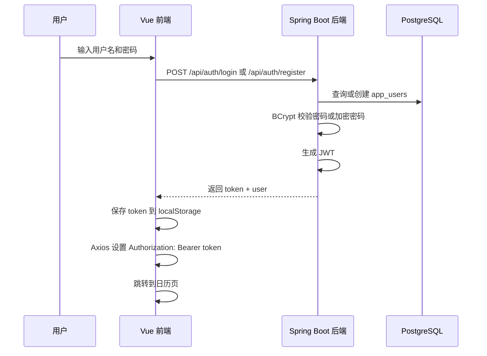
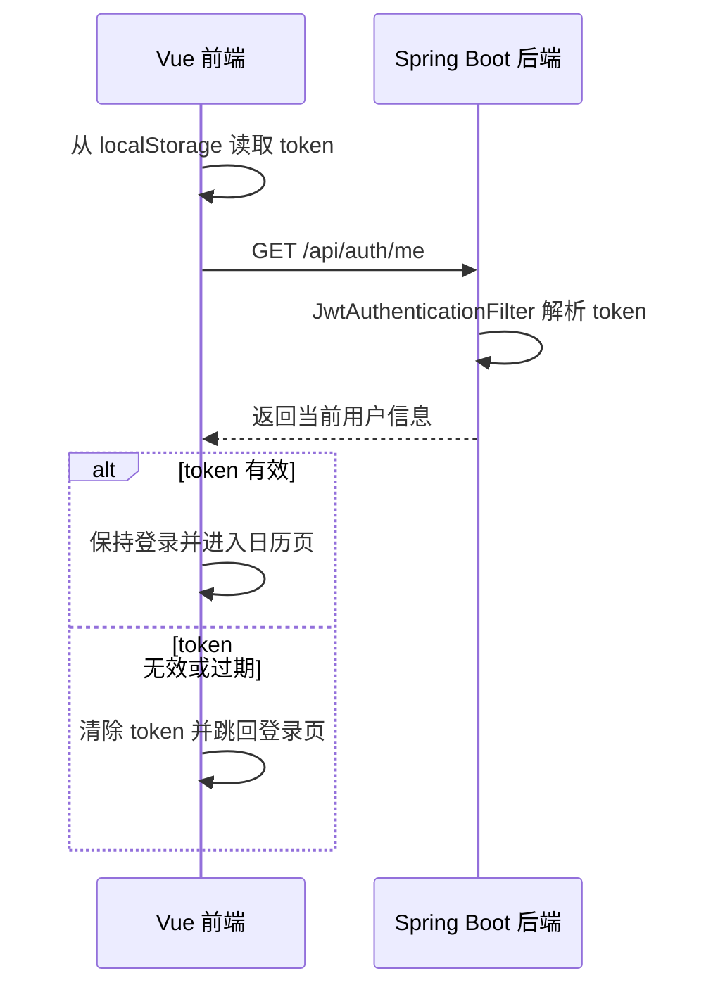
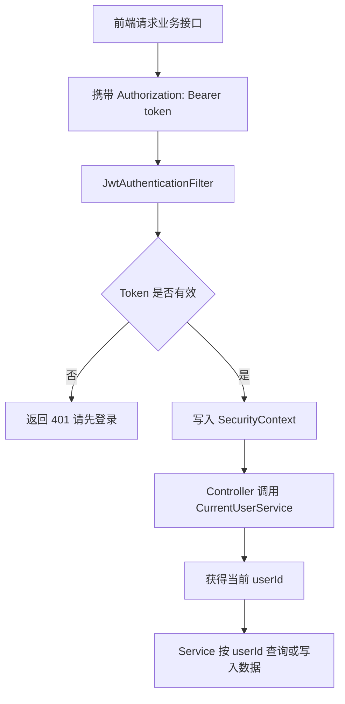
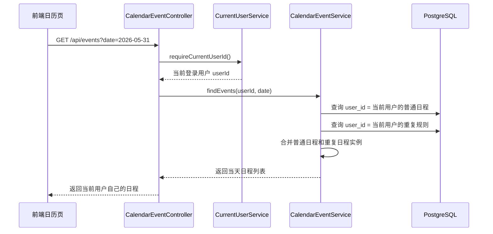

# 登录功能与用户信息隔离

## 1. 功能目标

本项目通过登录注册、JWT 鉴权和数据库 `user_id` 过滤，实现“每个用户只能查看和操作自己的日程数据”。隔离范围包括：

- 普通日程：`calendar_events`
- 重复日程规则：`recurring_events`
- 语音识别 WebSocket：`/ws/speech`
- 语音 Agent 和 AI 助手接口

未登录用户不能访问日程、Agent、AI 助手等会消耗模型额度或读取个人数据的接口。

## 2. 使用技术

| 层级 | 技术 | 作用 |
|---|---|---|
| 前端 | Vue 3 + TypeScript | 登录页、日历页和状态联动 |
| 前端 | Vue Router | 控制 `/login` 和日历首页的访问跳转 |
| 前端 | Pinia | 保存登录状态、用户信息、Token |
| 前端 | Axios | 统一 HTTP 请求和 `Authorization` 头注入 |
| 后端 | Spring Boot 3.5 | REST API 服务 |
| 后端 | Spring Security | 统一接口鉴权、禁用 Session、启用 JWT |
| 后端 | JJWT | 生成和解析 JWT |
| 后端 | BCrypt | 用户密码哈希存储 |
| 后端 | Spring Data JPA | 用户、普通日程、重复日程的数据访问 |
| 数据库 | PostgreSQL | 持久化用户与日程数据 |
| WebSocket | HandshakeInterceptor | 语音连接建立阶段校验登录态 |

## 3. 核心数据结构

### 用户表

`app_users` 保存用户基础信息：

- `id`：用户主键
- `username`：登录用户名，唯一
- `password_hash`：BCrypt 哈希后的密码
- `display_name`：昵称，可为空
- `created_at` / `updated_at`：创建和更新时间

### 普通日程表

`calendar_events` 使用 `user_id` 绑定所属用户。

查询、更新、删除时不会只按 `id` 操作，而是使用 `id + user_id` 一起定位，例如：

- `findByIdAndUserId`
- `existsByIdAndUserId`
- `deleteByIdAndUserId`
- `findEventsOnDate(userId, ...)`

### 重复日程表

`recurring_events` 同样使用 `user_id` 绑定用户，重复规则不会展开存储成大量普通日程，而是在查询时按用户和日期范围动态生成展示实例。

## 4. 前后端交互流程

### 4.1 登录注册流程



登录成功后，前端保存：

- `localStorage["voice-calendar-token"]`
- Pinia `authStore.currentUser`
- Axios 默认请求头 `Authorization`

### 4.2 页面刷新后的登录恢复



### 4.3 接口鉴权流程



后端 `SecurityConfig` 采用无状态设计：

- 关闭 CSRF、表单登录、HTTP Basic、Logout
- `SessionCreationPolicy.STATELESS`
- `/api/auth/**` 和 `/api/speech/config` 放行
- 其他接口默认需要登录

### 4.4 日程数据隔离流程

以查询某一天日程为例：



创建、删除、编辑普通日程和重复日程也都由后端从登录态获取 `userId`，前端不传 `userId`，这样可以避免用户伪造请求操作其他人的数据。

### 4.5 语音 WebSocket 登录校验

浏览器 WebSocket 不方便像 Axios 一样统一注入请求头，因此前端把 JWT 放到连接地址：

```text
ws://localhost:8080/ws/speech?token=JWT
```

后端 `SpeechWebSocketAuthInterceptor` 在握手阶段解析：

- 优先读取 `Authorization: Bearer token`
- 没有请求头时读取 query 参数 `token`
- token 无效则直接返回 `401`

这样可以避免未登录用户直接连接语音识别服务消耗 API Key 额度。

## 5. 做过的优化

### 5.1 用户隔离由后端强制完成

前端不传 `userId`，后端统一从 `SecurityContext` 获取当前用户。即使用户手动构造请求，也不能指定别人的 `userId`。

### 5.2 所有业务查询都带 `user_id`

普通日程和重复日程都按 `user_id` 查询。删除和编辑也使用 `id + user_id` 定位，避免“知道别人 id 就能操作”的问题。

### 5.3 未登录自动回登录页

Axios 响应拦截器发现 `401` 后，会触发登录失效处理，清除本地 Token，避免页面长期停留在不可用状态。

### 5.4 密码不明文存储

注册时使用 BCrypt 存储密码哈希，登录时使用 `passwordEncoder.matches` 校验。

### 5.5 WebSocket 也纳入鉴权

语音识别 WebSocket 不是裸连，必须携带登录 Token。这样语音识别、Agent 执行、AI 助手都需要登录后才能使用。

### 5.6 重复日程不展开入库

重复日程只存规则，查询时动态展开实例，既减少数据库膨胀，也方便整条重复规则统一删除。

## 6. 当前接口清单

| 接口 | 方法 | 是否登录 | 作用 |
|---|---|---|---|
| `/api/auth/register` | POST | 否 | 注册并返回 Token |
| `/api/auth/login` | POST | 否 | 登录并返回 Token |
| `/api/auth/me` | GET | 是 | 获取当前用户 |
| `/api/events` | GET/POST | 是 | 查询或创建普通日程 |
| `/api/events/{id}` | GET/PUT/DELETE | 是 | 查询、编辑、删除普通日程 |
| `/api/recurring-events` | GET/POST | 是 | 查询或创建重复日程规则 |
| `/api/recurring-events/{id}` | GET/PUT/DELETE | 是 | 查询、编辑、删除重复规则 |
| `/api/agent/chat` | POST | 是 | 语音文本执行日程指令 |
| `/api/agent/confirm` | POST | 是 | 确认待执行操作 |
| `/api/agent/cancel` | POST | 是 | 取消待执行操作 |
| `/api/assistant/chat/stream` | POST | 是 | AI 助手流式对话 |
| `/ws/speech` | WebSocket | 是 | 实时语音识别 |

## 7. 验证方式

1. 注册两个不同用户。
2. 用户 A 创建普通日程和重复日程。
3. 用户 B 登录后查询日历，应看不到用户 A 的日程。
4. 不带 Token 调用 `/api/events`，应返回 `401`。
5. 不带 Token 连接 `/ws/speech`，应握手失败。
6. 带用户 A 的 Token 删除用户 B 的日程 id，应删除失败或找不到目标。
