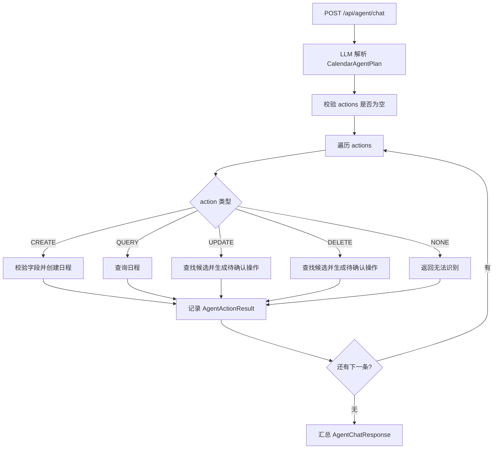

# 多条语音指令 Agent 技术方案

## 背景

改造前，Voice Calendar 的 Agent 更适合处理“一次输入一条日程指令”。

例如：

```text
今天下午三点开会
```

当时的链路可以稳定识别为一个创建日程操作。

但如果用户一次说多条指令：

```text
今天下午三点开会，明天上午九点复习英语，后天晚上八点跑步
```

改造前系统并不能稳定创建三条日程。原因是后端稳妥模式只支持一个 `CalendarAgentIntent`，也就是一次请求只能表达一个 `action`。

本文档说明如何把单意图 Agent 升级为多指令 Agent。当前第一版已经落地在 Agent 稳妥模式中，语音审查模式可以把一段文本发送给 Agent，由后端拆成多条日程指令逐条处理。

## 当前落地状态

已经实现的范围：

- 后端新增 `CalendarAgentPlan`，使用 `actions: List<CalendarAgentIntent>` 表达多条日程指令。
- 后端新增 `AgentActionResult`，记录每条指令的执行状态、提示信息、候选日程和待确认操作。
- `AgentChatResponse` 扩展 `batch` 和 `results` 字段，同时保留原有 `event`、`candidates`、`pendingAction` 字段，兼容单条结果。
- 稳妥模式中 `AgentService` 会先让 LLM 输出 Plan JSON，再由 Java 后端最多处理 8 条 action。
- `CREATE` 和 `QUERY` 可以逐条直接执行；`UPDATE` 和 `DELETE` 仍然逐条生成待确认操作。
- 单条失败不会回滚其它已成功的安全操作。
- 前端语音弹窗会展示 `results` 列表，并在每条待确认结果下展示独立的“确认执行”按钮。

暂未实现的范围：

- 语音自动模式仍然以第一句 `final=true` 为自动提交触发点，暂不做多句收集窗口。
- Agent 自动模式仍然走 Function Calling / Tool Calling，不作为第一版结构化多指令的主路径。
- 暂未提供“一键确认全部”，修改和删除仍然要求逐条确认。

## 改造前限制与当前边界

### Agent 层限制

改造前稳妥模式结构是：

```text
用户文本
-> LLM 解析一个 CalendarAgentIntent
-> Java 根据 action 执行一个操作
```

`CalendarAgentIntent` 只有一个：

```text
action
title
date
startTime
targetId
newStartTime
...
```

它不能表达：

```text
actions: [
  创建今天三点会议,
  创建明天九点复习,
  创建后天八点跑步
]
```

所以改造前多条指令会出现以下风险：

- 只处理第一条。
- 只处理模型认为最重要的一条。
- 把多条日程错误合并成一个日程。
- 修改、删除、创建混在一起时结果不可控。

当前稳妥模式已经通过 `CalendarAgentPlan` 解决了这一层限制；但它仍然依赖 LLM 的拆分质量，因此提示词中保留了拆分规则、置信度和 reason 字段，方便后续排查。

### 语音自动模式限制

当前语音自动模式逻辑是：

```text
收到第一个 final=true
-> 延迟 600ms
-> 自动停止录音
-> 自动发送给 Agent
```

这对一句话创建日程很方便，但对连续多句不友好。

例如：

```text
今天下午三点开会。明天上午九点复习英语。
```

如果 DashScope 在第一句后返回 `final=true`，前端可能会自动停录，导致第二句没有被完整采集。

## 目标

多指令能力的目标不是简单让 LLM “自由发挥”，而是让系统能够稳定、可控地处理批量日程操作。

目标：

1. 一次输入可以包含多条日程指令。
2. 每条指令都解析成独立结构。
3. 后端逐条校验和执行。
4. 查询和创建可以直接执行。
5. 修改和删除仍然保留确认机制。
6. 单条失败不能影响已经成功执行的其他安全操作。
7. 前端能展示每条指令的执行结果。

## 推荐总体方案

把当前：

```text
CalendarAgentIntent
```

升级为：

```text
CalendarAgentPlan {
  actions: CalendarAgentAction[]
}
```

核心变化：

```text
一次用户输入
-> LLM 解析成一个计划 Plan
-> Plan 中包含多条 Action
-> Java 后端逐条执行 Action
-> 返回批量执行结果
```

## 数据结构设计

### CalendarAgentPlan

新增 DTO：

```java
public record CalendarAgentPlan(
        List<CalendarAgentAction> actions,
        String summary,
        Double confidence
) {
}
```

字段说明：

| 字段 | 说明 |
|---|---|
| `actions` | 本次输入解析出的多条操作 |
| `summary` | LLM 对本次计划的一句话总结 |
| `confidence` | 整体置信度 |

### CalendarAgentAction

可以复用现有 `CalendarAgentIntent` 的字段，也可以新建语义更清晰的 DTO。

推荐新建：

```java
public record CalendarAgentAction(
        String action,
        String title,
        String date,
        String startTime,
        String endTime,
        String location,
        String description,
        String tag,
        String reminderTime,
        Long targetId,
        String targetTitleKeyword,
        String targetStartTime,
        String newTitle,
        String newDate,
        String newStartTime,
        String newEndTime,
        String newLocation,
        String newDescription,
        String newTag,
        String newReminderTime,
        Double confidence,
        String reason
) {
}
```

短期也可以直接让：

```text
CalendarAgentPlan.actions: List<CalendarAgentIntent>
```

这样改动更小。

### AgentActionResult

新增每条 action 的执行结果：

```java
public record AgentActionResult(
        int index,
        String action,
        boolean success,
        boolean needsConfirmation,
        String message,
        CalendarEvent event,
        List<CalendarEvent> candidates,
        PendingAgentAction pendingAction
) {
}
```

字段说明：

| 字段 | 说明 |
|---|---|
| `index` | 第几条指令，从 0 或 1 开始均可，建议前端展示从 1 开始 |
| `action` | CREATE、QUERY、UPDATE、DELETE、NONE |
| `success` | 当前指令是否执行成功 |
| `needsConfirmation` | 当前指令是否需要用户确认 |
| `message` | 当前指令的执行结果说明 |
| `event` | 创建或更新后的日程 |
| `candidates` | 查询结果或待确认候选 |
| `pendingAction` | 单条待确认操作 |

### 响应结构选择

改造前 `AgentChatResponse` 更适合单条结果。

设计时有两种选择：一种是新增独立批量响应，例如：

```java
public record AgentBatchResponse(
        String content,
        boolean aiEnabled,
        boolean success,
        String mode,
        boolean batch,
        List<AgentActionResult> results,
        List<PendingAgentAction> pendingActions
) {
}
```

另一种是兼容现有前端，在 `AgentChatResponse` 中增加：

```text
batch: boolean
results: AgentActionResult[]
```

当前采用的做法：

- 扩展 `AgentChatResponse`，新增 `batch` 和 `results`。
- 单条和多条都可以返回 `results`，前端优先按列表展示。
- 同时保留旧字段，避免破坏已有单条结果展示和确认逻辑。

暂不新增 `AgentBatchResponse`，等后续接口稳定后再考虑拆分独立响应 DTO。

## LLM 提示词设计

稳妥模式的提示词需要从“输出一个 JSON 对象”改成“输出一个 Plan JSON 对象”。

示例要求：

```text
请把用户的语音文本解析成一个 JSON 对象。
如果用户包含多条日程管理指令，请拆成多条 actions。
每条 action 只能是 CREATE、QUERY、UPDATE、DELETE、NONE。
不要把多条日程合并成一条。
只输出 JSON，不要输出 Markdown。
```

输出示例：

```json
{
  "summary": "用户想创建三条日程",
  "confidence": 0.93,
  "actions": [
    {
      "action": "CREATE",
      "title": "开会",
      "date": "2026-05-30",
      "startTime": "15:00",
      "tag": "会议",
      "confidence": 0.95,
      "reason": "用户说今天下午三点开会"
    },
    {
      "action": "CREATE",
      "title": "复习英语",
      "date": "2026-05-31",
      "startTime": "09:00",
      "tag": "学习",
      "confidence": 0.94,
      "reason": "用户说明天上午九点复习英语"
    },
    {
      "action": "CREATE",
      "title": "跑步",
      "date": "2026-06-01",
      "startTime": "20:00",
      "tag": "运动",
      "confidence": 0.92,
      "reason": "用户说后天晚上八点跑步"
    }
  ]
}
```

需要强调的规则：

- 多条创建必须拆开。
- “然后、还有、再、顺便、以及、另外”通常表示多条指令。
- 一句话里出现多个明确时间点，通常应拆成多条。
- 如果某条缺少必要字段，只让该条失败，不影响其他条。
- 修改和删除只提取候选，不要假装已经执行。

## 后端执行策略

### 稳妥模式

推荐流程：



### 操作执行原则

| 操作 | 批量处理策略 |
|---|---|
| CREATE | 信息完整就直接创建 |
| QUERY | 可以直接查询 |
| UPDATE | 不直接修改，生成单条待确认操作 |
| DELETE | 不直接删除，生成单条待确认操作 |
| NONE | 标记该条失败 |

### 部分失败策略

推荐采用“部分成功”。

例如用户说：

```text
今天三点开会，明天复习
```

第一条完整，可以创建。

第二条缺少开始时间，失败并提示：

```text
第 1 条：已添加日程：开会 2026-05-30 15:00
第 2 条：缺少创建日程所需的开始时间
```

不要因为第二条失败而回滚第一条。

### 事务策略

第一版推荐：

```text
每条 action 独立事务
```

原因：

- 多指令更像批处理。
- 单条失败不应该影响其他已成功创建的日程。
- 用户体验更好。

实现方式：

- 当前 `CalendarEventService.createEvent/updateEvent/deleteEvent` 已经各自有 `@Transactional`。
- `AgentService` 遍历执行时不额外包一个大事务。

如果未来要支持“全部成功或全部失败”，再引入 batch transaction。

## 确认机制设计

当前确认接口：

```text
POST /api/agent/confirm
```

一次确认一个 `PendingAgentAction`。

多指令下可以保留该接口不变。

例如用户说：

```text
删除今天三点的会，把明天九点的复习改到十点
```

后端返回：

```text
第 1 条：找到待删除日程，需要确认
第 2 条：找到待修改日程，需要确认
```

前端展示两个确认按钮：

```text
[确认第 1 条]
[确认第 2 条]
```

每个按钮提交自己的：

```json
{
  "id": "pending-action-id"
}
```

### 是否需要“一键确认全部”

第一版不建议做。

原因：

- 删除和修改风险高。
- 多条确认可能混合不同操作。
- 用户逐条确认更安全。

后续可以增加：

```text
POST /api/agent/confirm-batch
```

但不是第一优先级。

## 前端展示设计

当前前端只有一个：

```text
voiceAgentMessage
pendingAgentAction
```

多指令后需要支持：

```text
agentResults: AgentActionResult[]
```

推荐展示方式：

```text
Agent 回复

1. 已添加日程：开会，今天 15:00
2. 已添加日程：复习英语，明天 09:00
3. 需要确认删除：后天 20:00 跑步 [确认执行]
4. 创建失败：缺少开始时间
```

每条结果单独展示状态：

| 状态 | 展示 |
|---|---|
| 成功 | 普通结果文本 |
| 失败 | 错误提示 |
| 待确认 | 结果文本 + 确认按钮 |

短期也可以先把批量结果拼成一段文本放到 `voiceAgentMessage` 中，只对第一条待确认操作保留按钮。但这会牺牲多条修改/删除的可用性。

推荐第一版前端就支持多条结果列表。

## 语音识别配合方案

多指令能力不仅是 Agent 问题，也和语音自动提交有关。

### 审查模式

审查模式天然适合多指令：

```text
用户说多条
-> 前端展示完整文本
-> 用户手动确认或修改
-> 发送给 Agent
-> Agent 解析成多条 actions
```

优先建议先在语音审查模式下支持多指令。

### 自动模式

当前自动模式收到第一个 `final=true` 就提交，不适合多句。

如果要在自动模式下支持多指令，需要新增“多句收集窗口”。

推荐方案：

```text
收到 final=true
-> 不立即提交
-> 开启一个 1500ms 到 2500ms 的等待窗口
-> 如果窗口内又收到新的 final，则继续拼接文本并重置等待窗口
-> 等待窗口结束后再自动停止录音并提交 Agent
```

新增配置建议：

```text
VOICE_MULTI_COMMAND_IDLE_MS = 2000
```

和当前 `VOICE_AUTO_SUBMIT_DELAY_MS = 600` 的区别：

| 配置 | 作用 |
|---|---|
| `VOICE_AUTO_SUBMIT_DELAY_MS` | 单句结束后的短延迟 |
| `VOICE_MULTI_COMMAND_IDLE_MS` | 多句模式下等待用户是否还有下一句 |

第一版建议：

- 审查模式支持多指令。
- 自动模式仍保持当前“一句自动提交”。

等 Agent 批量执行稳定后，再升级自动模式为多句收集。

## 自动模式与稳妥模式的关系

多指令能力优先落在 Agent 稳妥模式。

原因：

- 稳妥模式由 Java 后端逐条审查执行，更可控。
- 修改和删除可以保留确认机制。
- 多条结果可以结构化返回。

Agent 自动模式下，LLM 直接 Tool Calling，理论上可以连续调用多个工具，但不建议作为第一版多指令方案。

原因：

- 多工具调用顺序不够显式。
- 不容易做部分失败统计。
- 不容易把每条结果结构化展示给前端。
- 修改和删除的风险控制弱。

建议：

| 模式 | 多指令支持策略 |
|---|---|
| Agent 稳妥模式 | 第一版重点支持 |
| Agent 自动模式 | 暂时提示“不建议多条指令”，后续再做 |

## 接口兼容方案

当前前端调用：

```text
POST /api/agent/chat
```

不建议新增接口，继续使用该接口。

请求仍然保持：

```json
{
  "message": "今天三点开会，明天九点复习",
  "conversationId": "voice-xxx",
  "mode": "review"
}
```

响应扩展为：

```json
{
  "content": "共处理 2 条指令：第 1 条已添加，第 2 条已添加。",
  "aiEnabled": true,
  "success": true,
  "mode": "review",
  "action": "BATCH",
  "needsConfirmation": false,
  "event": null,
  "candidates": [],
  "pendingAction": null,
  "batch": true,
  "results": [
    {
      "index": 1,
      "action": "CREATE",
      "success": true,
      "needsConfirmation": false,
      "message": "已添加日程：开会，2026-05-30 15:00",
      "event": {}
    },
    {
      "index": 2,
      "action": "CREATE",
      "success": true,
      "needsConfirmation": false,
      "message": "已添加日程：复习英语，2026-05-31 09:00",
      "event": {}
    }
  ]
}
```

如果只有一条 action，也可以仍然走原来的单条响应格式。

但为了前端统一，推荐：

```text
无论一条还是多条，后端都可以返回 results。
```

同时保留旧字段，避免破坏已有前端逻辑。

## 开发步骤建议

### 第一阶段：稳妥模式支持批量创建和查询

状态：已实现。

目标：

- 新增 `CalendarAgentPlan`。
- LLM 输出 `actions` 数组。
- 后端遍历执行 CREATE 和 QUERY。
- 前端展示多条结果。

当前实现已经不只支持 CREATE 和 QUERY，也支持 UPDATE/DELETE 逐条生成待确认操作。

### 第二阶段：批量修改和删除确认

状态：已实现。

目标：

- 每条 UPDATE/DELETE 生成自己的 `PendingAgentAction`。
- 前端每条结果展示独立确认按钮。
- 确认接口保持 `POST /api/agent/confirm` 不变。

### 第三阶段：语音自动模式多句收集

状态：未实现，暂不优先。

目标：

- 自动模式不再收到第一个 `final=true` 就立刻提交。
- 增加多句等待窗口。
- 支持连续说多条日程。

### 第四阶段：完善 Agent 自动模式

状态：未实现，后续评估。

目标：

- 评估 Tool Calling 连续调用多个工具的稳定性。
- 如果效果不好，自动模式也可以复用 Plan 解析，再由后端执行。

## 风险与处理

| 风险 | 处理方式 |
|---|---|
| LLM 把一条复杂指令拆错 | 提示词强调拆分规则，并保留 reason 字段便于排查 |
| LLM 把多条日程合并成一条 | 提示词要求多个明确时间点必须拆开 |
| 部分 action 缺字段 | 单条失败，不影响其他 action |
| 批量删除风险高 | 删除只生成待确认操作，不直接执行 |
| 自动语音模式过早提交 | 第一版先只在审查模式支持多指令 |
| 前端展示复杂度上升 | 用 results 列表逐条展示 |

## 测试方案

### 后端测试

建议新增测试：

| 测试 | 预期 |
|---|---|
| 一次输入两条 CREATE | 创建两条日程 |
| 一条 CREATE 完整，一条 CREATE 缺时间 | 第一条成功，第二条失败 |
| CREATE + QUERY 混合 | 创建成功，查询返回结果 |
| DELETE 多条 | 不直接删除，返回多个待确认操作 |
| 不同用户批量操作 | 只能操作当前用户数据 |

### 前端测试

建议验证：

| 场景 | 预期 |
|---|---|
| 输入两条创建指令 | Agent 回复展示两条成功结果 |
| 输入一条成功一条失败 | 成功和失败状态分别展示 |
| 输入删除和修改 | 每条待确认结果都有确认按钮 |
| 确认其中一条 | 只执行该条确认操作 |

### 语音测试

第一版建议在审查模式验证：

```text
今天下午三点开会，明天上午九点复习英语
```

预期：

```text
识别文本完整展示
手动发送给 Agent
创建两条日程
```

自动模式多句收集等第三阶段再测。

## 推荐结论

推荐先不要直接改成“LLM 自己循环调用多个工具”的 Agent。

更稳妥的路线是：

```text
单意图 Intent
-> 多意图 Plan
-> Java 后端逐条审查执行
-> 前端逐条展示结果和确认按钮
```

这样可以最大程度复用当前稳妥模式、用户隔离、确认过期时间、日程 CRUD 和前端语音弹窗，同时把多指令处理做得可控、可测试、可解释。
