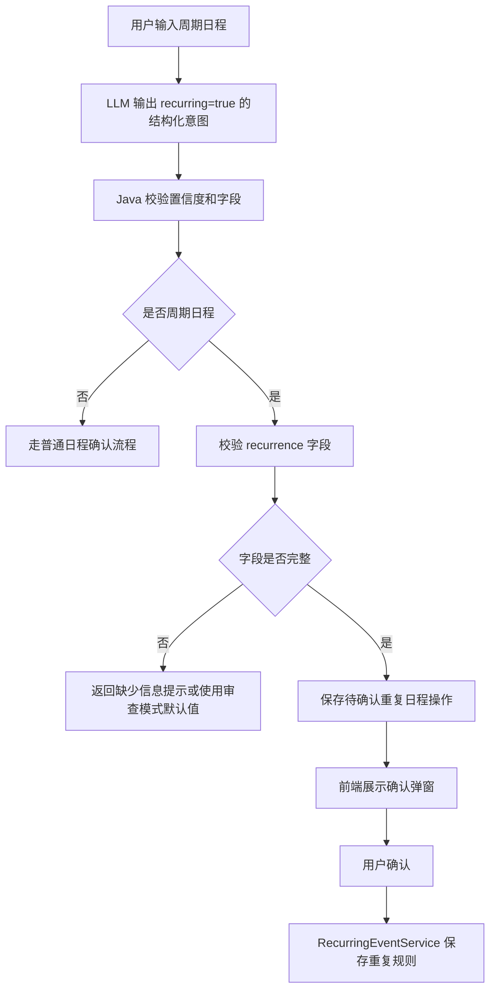

# 重复日程与双模式 Agent 改造计划

## 背景

当前 Voice Calendar 已经支持通过语音和 Agent 创建、查询、修改、删除单次日程。

但当用户输入包含周期语义时，例如：

- 本周每天晚上都要背单词
- 今年每天晚上都要背单词
- 每周一三五晚上跑步
- 工作日早上八点提醒我打卡

如果系统把这些请求直接展开成多条普通日程，会带来明显问题：

- 数据库可能被大量普通日程填满。
- “今年每天背单词”会生成数百条记录。
- 后续修改、删除、暂停某一天会非常麻烦。
- 自动模式下模型可能在没有风险判断的情况下直接创建大量日程。

因此需要引入“重复日程规则”，并同步改造审查模式和自动模式 Agent。

## 总体目标

本次改造目标是：

1. 识别“每天、每周、每月、工作日、本周每天、今年每天”等周期表达。
2. 周期表达不再展开为多条普通日程，而是保存为一条重复日程规则。
3. 审查模式支持创建重复日程，但必须用户确认后执行。
4. 自动模式支持识别周期意图，但长期或不完整的周期日程不能直接自动执行。
5. 后端提供强校验，不能只依赖提示词或 Tool 描述。

## 设计原则

### 1. 存规则，不存展开结果

重复日程应该存一条规则，而不是存 N 条普通日程。

例如：

```text
今年每天晚上八点背单词
```

数据库中只保存一条重复规则：

```text
title = 背单词
startDate = 2026-05-30
endDate = 2026-12-31
startTime = 20:00
recurrenceType = DAILY
intervalValue = 1
```

用户查看某一天时，后端根据规则动态生成当天的虚拟日程实例。

### 2. Agent 负责理解，Java 负责限制

LLM 可以判断用户是不是在说周期日程，但是否允许创建、是否需要确认、是否超出风险上限，必须由 Java 后端决定。

### 3. 审查模式偏稳妥

审查模式中，所有周期日程创建都必须确认。

即使信息完整，也先返回弹窗：

```text
将创建重复日程：
标题：背单词
频率：每天
时间：20:00
范围：2026-05-30 至 2026-12-31
```

用户点击确认后再写入数据库。

### 4. 自动模式偏保守

自动模式不能无约束创建周期日程。

第一版建议：

- 自动模式遇到周期日程，默认拒绝自动执行。
- 返回提示：检测到周期日程，请切换审查模式确认后创建。
- 后续再开放短周期自动创建，例如最多 7 天或 14 天。

## 数据模型设计

### 现有普通日程表

现有 `calendar_events` 继续表示单次日程。

它适合保存：

- 今天下午三点开会
- 明天上午九点面试
- 周五晚上七点吃饭

### 新增重复日程表

建议新增 `recurring_events` 表。

字段设计：

| 字段 | 类型建议 | 说明 |
|---|---|---|
| `id` | BIGSERIAL | 主键 |
| `user_id` | BIGINT | 用户 ID，用于用户隔离 |
| `title` | VARCHAR | 日程标题 |
| `start_date` | DATE | 重复开始日期 |
| `end_date` | DATE | 重复结束日期，不允许为空 |
| `start_time` | TIME | 每次日程开始时间 |
| `end_time` | TIME | 每次日程结束时间，可选 |
| `recurrence_type` | VARCHAR | `DAILY` / `WEEKLY` / `MONTHLY` |
| `interval_value` | INT | 每 N 天、每 N 周、每 N 月 |
| `days_of_week` | VARCHAR | 周几集合，例如 `MON,WED,FRI` |
| `day_of_month` | INT | 每月几号，可选 |
| `location` | VARCHAR | 地点 |
| `description` | TEXT | 备注 |
| `tag` | VARCHAR | 标签 |
| `reminder_time` | TIME | 每次日程提醒时间，可选 |
| `created_at` | TIMESTAMP | 创建时间 |
| `updated_at` | TIMESTAMP | 更新时间 |

第一版可以先只支持：

- `DAILY`
- `WEEKLY`
- `days_of_week`

`MONTHLY` 可以放到后续。

### 重复日程实例 DTO

前端查看某一天时，后端返回普通日程和重复日程实例。

建议统一返回一个新的日程视图 DTO，例如 `CalendarEventView`：

| 字段 | 说明 |
|---|---|
| `id` | 普通日程使用数据库 ID，重复实例使用虚拟 ID |
| `sourceType` | `SINGLE` / `RECURRING` |
| `recurringEventId` | 重复规则 ID，普通日程为空 |
| `title` | 标题 |
| `startTime` | 当天实例的完整开始时间 |
| `endTime` | 当天实例的完整结束时间 |
| `location` | 地点 |
| `description` | 备注 |
| `tag` | 标签 |
| `reminderTime` | 当天实例的完整提醒时间 |

虚拟 ID 示例：

```text
recurring-12-2026-06-01
```

这样前端可以区分普通日程和重复实例。

## 后端服务设计

### 新增模块

建议新增以下文件：

```text
backend/src/main/java/com/cyx/backend/entity/RecurringEventEntity.java
backend/src/main/java/com/cyx/backend/repository/RecurringEventRepository.java
backend/src/main/java/com/cyx/backend/service/RecurringEventService.java
backend/src/main/java/com/cyx/backend/controller/RecurringEventController.java
backend/src/main/java/com/cyx/backend/dto/RecurringEventRequest.java
backend/src/main/java/com/cyx/backend/dto/RecurringEventResponse.java
backend/src/main/java/com/cyx/backend/event/RecurrenceType.java
```

### 查询逻辑

查询某天日程时：

```text
普通日程 = calendar_events 中当天数据
重复实例 = recurring_events 中命中当天的规则动态生成
返回 普通日程 + 重复实例
```

命中规则：

```text
date >= startDate
date <= endDate
```

如果是 `DAILY`：

```text
(date - startDate) % intervalValue == 0
```

如果是 `WEEKLY`：

```text
date 的星期在 daysOfWeek 中
并且 week distance 满足 intervalValue
```

### 创建限制

后端必须强制校验：

| 限制 | 说明 |
|---|---|
| `endDate` 必填 | 不允许无限重复 |
| `startDate <= endDate` | 日期范围必须合法 |
| `startTime` 必填 | 不能创建没有时间的重复日程 |
| `intervalValue >= 1` | 间隔必须合法 |
| 最大跨度限制 | 例如最多 366 天 |
| 自动模式跨度限制 | 例如第一版自动模式不允许创建周期日程 |

## Agent 意图结构改造

### CalendarAgentIntent 新增字段

建议在 `CalendarAgentIntent` 中新增：

| 字段 | 类型 | 说明 |
|---|---|---|
| `recurring` | Boolean | 是否重复日程 |
| `recurrenceType` | String | `DAILY` / `WEEKLY` / `MONTHLY` |
| `recurrenceStartDate` | String | 开始日期，`yyyy-MM-dd` |
| `recurrenceEndDate` | String | 结束日期，`yyyy-MM-dd` |
| `recurrenceInterval` | Integer | 每 N 天/周/月 |
| `recurrenceDaysOfWeek` | List/String | 周几集合 |
| `recurrenceReason` | String | 判断为周期日程的原因 |

### 解析规则

LLM 解析时需要区分单次日程和重复日程。

示例：

```text
本周每天晚上八点背单词
```

解析为：

```text
action = CREATE
recurring = true
title = 背单词
recurrenceType = DAILY
recurrenceStartDate = 本周开始日期或今天
recurrenceEndDate = 本周日
startTime = 20:00
tag = 学习
```

示例：

```text
今年每天晚上八点背单词
```

解析为：

```text
action = CREATE
recurring = true
title = 背单词
recurrenceType = DAILY
recurrenceStartDate = 当前日期
recurrenceEndDate = 当前年份 12-31
startTime = 20:00
tag = 学习
```

示例：

```text
每周一三五晚上跑步
```

解析为：

```text
action = CREATE
recurring = true
title = 跑步
recurrenceType = WEEKLY
recurrenceDaysOfWeek = MON,WED,FRI
startTime = 20:00
tag = 运动
```

如果没有结束日期：

```text
每天晚上背单词
```

第一版建议不要自动补无限结束日期。

审查模式可以给默认结束日期，例如未来 30 天，并在确认弹窗明确展示：

```text
未指定结束日期，系统默认创建未来 30 天的重复日程。
```

自动模式则直接失败：

```text
检测到周期日程但缺少结束日期，请切换审查模式确认后创建。
```

## 审查模式改造

### 目标

审查模式负责稳定处理周期日程，并通过确认弹窗让用户知道系统将创建的是一条重复规则，而不是多条普通日程。

### 流程



### 待确认操作设计

当前 `PendingAgentAction` 用于保存待确认操作。

可以选择两种方式：

#### 方案 A：扩展 PendingAgentAction

新增字段：

```text
recurring
recurrenceType
recurrenceStartDate
recurrenceEndDate
recurrenceInterval
recurrenceDaysOfWeek
```

优点：

- 改动较少。
- 复用当前确认流程。

缺点：

- `PendingAgentAction` 字段会越来越多。

#### 方案 B：新增 PendingRecurringAgentAction

新增专门 DTO。

优点：

- 结构更清晰。
- 后续扩展修改、删除重复日程更方便。

缺点：

- 前后端确认接口要处理多种 pending action 类型。

第一版推荐方案 A，速度更快。

### 审查模式校验规则

| 场景 | 行为 |
|---|---|
| 周期日程信息完整 | 生成待确认操作 |
| 没有结束日期 | 默认未来 30 天，弹窗明确提示 |
| 没有开始时间 | 返回失败，不创建 |
| 范围超过 1 年 | 允许进入确认，但弹窗突出显示范围 |
| 置信度低于审查阈值 | 返回低置信度失败 |
| 多条周期指令 | 逐条生成结果，逐条确认 |

## 自动模式改造

### 风险分析

自动模式最危险的地方是模型可以直接调用工具。

如果不限制，它可能：

- 把“今年每天背单词”展开成 365 次创建。
- 没有结束日期也创建长期日程。
- 把“每天晚上”擅自解释成某个时间。
- 把周期日程误当成多条普通日程。

因此自动模式必须增加更强约束。

### 第一版策略

第一版建议自动模式不直接创建周期日程。

规则：

| 场景 | 自动模式行为 |
|---|---|
| 单次日程，信息完整，置信度高 | 允许自动创建 |
| 周期日程 | 拒绝自动执行，提示切换审查模式 |
| 长期周期日程 | 拒绝自动执行 |
| 没有结束日期的周期日程 | 拒绝自动执行 |
| 模型试图展开多条普通日程 | 后端拦截 |

返回提示：

```text
检测到周期日程。为避免误创建大量日程，请切换审查模式确认后创建。
```

### 自动模式预检

当前自动模式已经有结构化意图预检和较高置信度阈值。

改造后，预检增加：

```text
如果 plan 中任意 action.recurring = true
直接返回失败，不进入 Tool Calling
```

也就是说，自动模式在调用 tool 前先拦住周期日程。

### 后端硬限制

即使提示词和预检都做了，后端仍然要限制普通日程批量创建。

建议增加：

| 限制 | 建议值 |
|---|---:|
| 单次 Agent 请求最多创建普通日程 | 7 条 |
| 自动模式单次请求最多创建普通日程 | 1 条 |
| 自动模式禁止创建周期日程 | 第一版禁用 |
| 普通日程 Tool 禁止用于周期表达 | Tool 描述 + 后端校验 |

## 周期日程 Tool 设计

### 是否需要 Tool

需要，但不要第一版就完全开放给自动模式。

新增 Tool 的主要价值：

- 让自动模式知道“周期日程应该调用周期 Tool，而不是普通日程 Tool”。
- 后续可以逐步开放短周期自动创建。
- 工具描述能帮助模型更稳定地区分普通日程和周期日程。

### createRecurringEvent Tool

建议新增：

```text
createRecurringEvent
```

参数：

| 参数 | 说明 |
|---|---|
| `title` | 标题 |
| `startDate` | 重复开始日期 |
| `endDate` | 重复结束日期，必填 |
| `startTime` | 每次开始时间 |
| `endTime` | 每次结束时间，可选 |
| `recurrenceType` | `DAILY` / `WEEKLY` / `MONTHLY` |
| `intervalValue` | 间隔 |
| `daysOfWeek` | 周几集合 |
| `location` | 地点 |
| `description` | 备注 |
| `tag` | 标签 |
| `reminderTime` | 提醒时间 |

Tool 描述必须写清楚：

- 周期日程只能调用 `createRecurringEvent`。
- 不能把周期日程展开成多个普通日程。
- 没有 `endDate` 不允许调用。
- 第一版自动模式不允许直接创建长期周期日程。

### 后端校验

Tool 描述只是给模型看的，不是安全边界。

`RecurringEventService` 必须再次校验：

- 是否有结束日期。
- 日期跨度是否超过限制。
- recurrenceType 是否合法。
- daysOfWeek 是否符合 recurrenceType。
- 用户是否登录。
- 是否属于当前用户。

## API 设计

### 创建重复日程

```text
POST /api/recurring-events
```

请求：

```json
{
  "title": "背单词",
  "startDate": "2026-05-30",
  "endDate": "2026-12-31",
  "startTime": "20:00",
  "endTime": null,
  "recurrenceType": "DAILY",
  "intervalValue": 1,
  "daysOfWeek": null,
  "tag": "学习"
}
```

### 查询重复规则

```text
GET /api/recurring-events
```

### 删除重复规则

```text
DELETE /api/recurring-events/{id}
```

第一版可以先只支持删除整个重复规则。

### 日程查询接口调整

现有：

```text
GET /api/events?date=2026-06-01
```

建议返回：

```text
普通日程 + 重复日程实例
```

如果担心破坏现有前端类型，可以新增：

```text
GET /api/calendar-items?date=2026-06-01
```

第一版推荐直接扩展现有 `/api/events` 返回字段，但要确认前端类型兼容。

## 前端改造

### 日程列表展示

重复日程实例旁边展示标签：

```text
重复
```

示例：

```text
20:00 背单词  [重复]
```

### Agent 确认弹窗

审查模式识别到周期日程后，弹窗内容应突出：

```text
将创建重复日程：
标题：背单词
频率：每天
时间：20:00
范围：2026-05-30 至 2026-12-31
标签：学习
```

如果系统使用默认结束日期，需要明确显示：

```text
未指定结束日期，系统默认创建未来 30 天。
```

### 删除交互

第一版只支持删除整个重复规则。

后续可以扩展：

- 只删除今天这一次。
- 删除今天及以后。
- 删除整个重复规则。

## 开发步骤

### 第 1 步：后端重复日程基础模型

目标：

- 新增 `recurring_events` 表。
- 新增 Entity、Repository、Service、DTO。
- 支持创建、查询、删除重复规则。

验收：

- 可以通过接口创建一条 `DAILY` 重复规则。
- 数据库只新增一条规则，不展开普通日程。

### 第 2 步：查询接口返回重复实例

目标：

- 查询某一天时返回普通日程 + 当天命中的重复实例。
- 前端能展示重复实例。

验收：

- 创建“每天 20:00 背单词”的重复规则。
- 查询任意命中日期，都能看到背单词。
- 数据库没有生成多条普通日程。

### 第 3 步：审查模式支持重复日程

目标：

- `CalendarAgentIntent` 支持 recurrence 字段。
- LLM 能把“本周每天晚上背单词”解析为 `recurring=true`。
- 审查模式生成待确认重复日程操作。

验收：

- 输入“本周每天晚上八点背单词”。
- 前端弹窗显示重复规则。
- 点击确认后只创建一条重复规则。

### 第 4 步：自动模式周期日程拦截

目标：

- 自动模式预检发现 `recurring=true` 时直接拒绝自动执行。
- 不进入 Tool Calling。
- 不允许模型展开创建多条普通日程。

验收：

- 自动模式输入“今年每天晚上八点背单词”。
- 系统返回提示，不写数据库。

### 第 5 步：新增周期日程 Tool

目标：

- 新增 `createRecurringEvent` Tool。
- Tool 描述明确周期日程不能调用普通创建工具。
- 第一版可不注册给自动模式，或注册但由后端策略禁止自动调用长期周期。

验收：

- Tool 参数完整。
- 后端 service 有强校验。

### 第 6 步：删除重复日程

目标：

- 支持删除整个重复规则。
- Agent 可以识别“取消每天背单词”。
- 审查模式必须确认。

验收：

- 创建每天背单词规则。
- 输入“取消每天背单词”。
- 确认后删除整个规则。

## 测试计划

### 后端单元与接口测试

需要覆盖：

- 创建 `DAILY` 重复规则。
- 创建 `WEEKLY` 重复规则。
- 查询命中日期返回重复实例。
- 查询非命中日期不返回重复实例。
- 没有结束日期时拒绝或默认策略生效。
- 自动模式周期日程被拦截。
- 审查模式确认后创建重复规则。
- 用户隔离：A 用户不能看到 B 用户重复规则。

### Agent 测试样例

| 输入 | 模式 | 预期 |
|---|---|---|
| 本周每天晚上八点背单词 | 审查 | 生成重复日程确认 |
| 今年每天晚上八点背单词 | 审查 | 生成长期重复日程确认 |
| 每天晚上背单词 | 审查 | 默认未来 30 天或提示缺少结束日期 |
| 今年每天晚上八点背单词 | 自动 | 拒绝自动执行 |
| 今天晚上八点背单词 | 自动 | 创建单次日程 |
| 每周一三五晚上跑步 | 审查 | 生成 WEEKLY 重复规则 |

## 推荐第一版范围

为了控制开发风险，第一版建议只做：

- `DAILY`
- `WEEKLY`
- 创建重复规则
- 查询某天重复实例
- 删除整个重复规则
- 审查模式创建重复规则
- 自动模式拦截周期日程

暂不做：

- 修改重复规则。
- 只删除某一天实例。
- 删除今天及以后。
- 复杂节假日规则。
- 农历或时区复杂处理。

## 最终效果

改造后：

```text
今年每天晚上八点背单词
```

不会再创建 365 条普通日程。

审查模式会生成一条待确认重复规则。

自动模式会拒绝直接执行，并提示用户切换审查模式。

数据库中只保存一条重复日程规则，前端查询具体日期时再动态展示当天实例。

## 本次落地范围

本次开发采用待确认操作设计方案 B：重复日程创建不复用单次日程的 `PendingAgentAction`，而是新增独立的 `PendingRecurringAgentAction`。这样可以避免把“重复规则”强行塞进“单次事件”结构里，后续扩展修改整条规则、删除整条规则、例外日期时也更清晰。

已完成能力：

1. 新增 `recurring_events` 规则表，只保存重复规则，不把周期日程展开成多条普通日程。
2. 新增重复日程的 Controller、Service、Repository、Request、Response 和 `RecurrenceType`。
3. 日程查询接口支持按日期范围查询，并自动合并普通日程和重复日程虚拟实例。
4. 重复实例返回 `sourceType=RECURRING`、`recurringEventId`、`instanceKey`，前端可区分普通日程和规则实例。
5. 审查模式下，Agent 识别到周期创建意图后，生成 `PendingRecurringAgentAction` 并等待用户确认，确认后才写入数据库。
6. 审查模式下，Agent 识别到周期删除意图后，生成 `DELETE_RECURRING` 待确认操作，确认后删除整条重复规则，不会误删当天的虚拟实例。
7. 后端增加周期词保护：即使模型漏填 `recurring=true`，单条指令里出现“每天、每周、本周每天、工作日”等周期表达时，也会强制进入重复日程分支。
8. 自动模式下，Agent 识别到周期意图后不会直接执行，统一返回“检测到周期日程。为避免误创建或误删除整条重复规则，请切换审查模式确认后执行。”
9. 前端日历使用可视月份范围加载日程，能展示重复实例，并用“重复”“规则日程”提示用户该项来自重复规则。
10. 第一版支持 `DAILY` 和 `WEEKLY`，`MONTHLY` 暂不开放创建。

第一版暂不支持：

1. 编辑重复规则。
2. 只跳过某一天的例外日期。
3. 自动模式直接创建或删除重复日程。
4. 按 RRULE 标准表达复杂重复规则。
