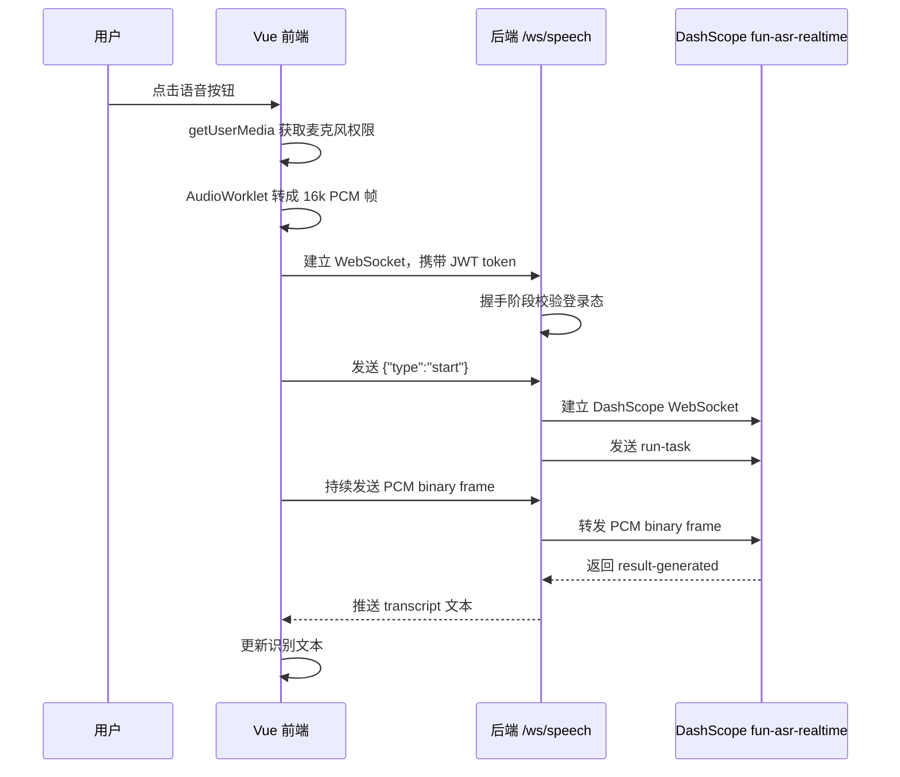
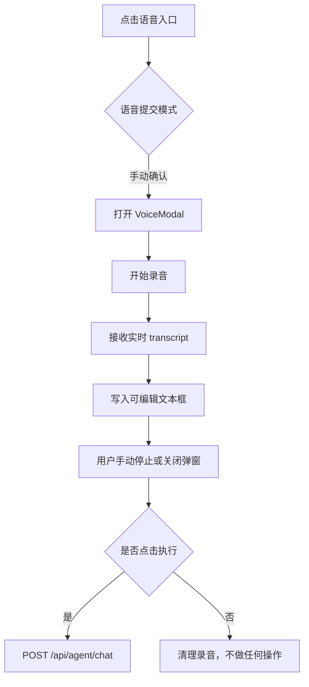
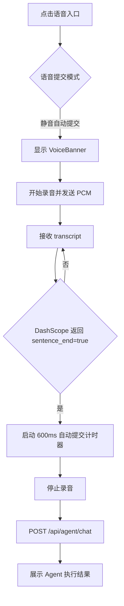
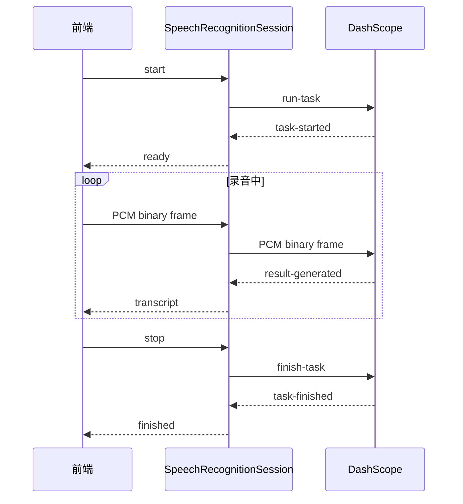

# 语音输入的两种模式

## 1. 功能目标

语音输入负责把用户说的话转成文本，再交给日程执行模块处理。当前项目把“语音提交模式”和“Agent 执行模式”拆开设计：

- 语音提交模式只决定“识别出的文字什么时候发送给后端 Agent”。
- Agent 执行模式只决定“Agent 收到文字后如何执行日程操作”。

因此用户可以自由组合：

- 手动确认语音 + 稳妥执行
- 手动确认语音 + 自动执行
- 静音自动提交 + 稳妥执行
- 静音自动提交 + 自动执行

## 2. 使用技术

| 层级 | 技术 | 作用 |
|---|---|---|
| 前端 | Web Audio API | 获取麦克风音频流 |
| 前端 | AudioWorklet | 在浏览器音频线程中把音频重采样为 PCM 帧 |
| 前端 | PCM 16k 单声道 | DashScope 实时语音识别要求的音频格式 |
| 前端 | WebSocket | 把 PCM 音频帧实时发送给后端 |
| 前端 | Pinia | 管理录音状态、识别文本、自动提交状态 |
| 后端 | Spring WebSocket | 接收前端音频帧和控制指令 |
| 后端 | Java HttpClient WebSocket | 连接 DashScope 实时语音识别服务 |
| 语音模型 | DashScope `fun-asr-realtime` | 实时语音转文字 |
| 配置 | `.env` + `application.properties` | 控制语音开关、模型、采样率、静音阈值 |

## 3. 关键配置

语音识别配置集中在后端环境变量中：

```properties
VOICE_CALENDAR_SPEECH_ENABLED=true
VOICE_CALENDAR_SPEECH_PROVIDER=dashscope
VOICE_CALENDAR_SPEECH_API_KEY=你的 DashScope Key
VOICE_CALENDAR_SPEECH_MODEL=fun-asr-realtime
VOICE_CALENDAR_SPEECH_ENDPOINT=wss://dashscope.aliyuncs.com/api-ws/v1/inference
VOICE_CALENDAR_SPEECH_SAMPLE_RATE=16000
VOICE_CALENDAR_SPEECH_FORMAT=pcm
VOICE_CALENDAR_SPEECH_MAX_SENTENCE_SILENCE=1300
VOICE_CALENDAR_SPEECH_SEMANTIC_PUNCTUATION_ENABLED=false
```

其中 `max_sentence_silence=1300` 表示模型侧用于判断一句话结束的静音时长。前端不自己训练 VAD 模型，而是利用 `fun-asr-realtime` 返回的 `sentence_end` 判断一句话是否结束。

## 4. 语音识别基础流程



## 5. 模式一：手动确认模式

### 5.1 使用方式

用户点击页面顶部的语音入口后，会打开语音弹窗：

1. 点击“开始录音”。
2. 说出日程指令。
3. 点击“停止”。
4. 在文本框中检查和修改识别结果。
5. 点击“执行日程操作”发送给 Agent。

### 5.2 前端流程



### 5.3 特点

- 用户可以修改识别文本，适合识别不准或长句场景。
- 关闭弹窗时会自动停止录音并清理 WebSocket、麦克风和 AudioContext。
- 文本发送 Agent 前有 50 字上限，避免误识别的长文本直接消耗模型额度。

## 6. 模式二：静音自动提交模式

### 6.1 使用方式

用户在设置中选择“静音自动提交”后，点击语音入口不会打开弹窗，而是在页面下方显示一个小条幅：

1. 点击语音入口。
2. 前端直接开始录音。
3. 条幅实时展示识别出的文本。
4. 模型检测到一句话结束后，前端延迟 600ms 自动提交给 Agent。
5. Agent 执行结果通过单独结果弹窗展示。

### 6.2 前端流程



### 6.3 自动停止依据

本项目没有单独引入前端 VAD 模型，而是使用 DashScope `fun-asr-realtime` 的实时断句能力：

- 前端持续发送 PCM。
- DashScope 根据 `max_sentence_silence` 判断一句话是否结束。
- 后端把 `sentence_end` 转成 `final: true` 推给前端。
- 前端在收到 final 文本后自动提交。

这样实现更轻，适合当前项目交付；如果后续要做更强的打断、长对话或本地离线识别，可以再引入 WebRTC VAD、Silero VAD 等方案。

## 7. 后端 WebSocket 流程

后端由 `SpeechRecognitionWebSocketHandler` 接收前端连接：

- 文本消息 `{"type":"start"}`：创建 DashScope 任务。
- 二进制消息：作为 PCM 音频帧转发。
- 文本消息 `{"type":"stop"}`：发送 DashScope `finish-task`。
- DashScope 返回 `result-generated`：解析识别文本并推送给前端。
- DashScope 返回 `task-finished`：关闭连接并通知前端。



## 8. AI 助手里的语音输入

侧边 AI 助手也复用了同一套语音识别通道：

- 点击助手面板中的语音按钮。
- 语音识别结果填入助手输入框。
- 用户再手动发送消息。

区别是：AI 助手语音不会自动提交，因为助手是聊天场景，用户可能需要继续补充或修改输入。

## 9. 做过的优化

### 9.1 语音模式和 Agent 模式解耦

语音模块只负责“文本何时提交”，Agent 模块只负责“如何执行”。这样后续调整自动语音提交，不会影响 Agent 审查逻辑。

### 9.2 WebSocket 登录校验

语音 WebSocket 必须携带 Token，未登录不能连接，避免恶意调用语音识别服务消耗额度。

### 9.3 PCM 帧前端生成

前端通过 `AudioWorklet` 将浏览器原始采样率重采样为 16k PCM，每 100ms 发送一帧，降低延迟。

### 9.4 关闭弹窗自动清理资源

手动确认模式下，如果用户录音中关闭弹窗，前端会停止麦克风、关闭 AudioContext、关闭 WebSocket，并且不会自动发送给 Agent。

### 9.5 自动模式使用模型断句

自动模式不依赖固定倒计时猜测用户是否说完，而是使用 `fun-asr-realtime` 的 `sentence_end`。前端只在模型确认一句话结束后再延迟 600ms 提交。

### 9.6 发送 Agent 前限制 50 字

语音识别文本和 AI 助手输入都限制 50 字，前端和后端双重校验，降低误识别长文本带来的错误执行和 token 消耗。

## 10. 验证方式

1. 手动确认模式下开始录音，说一句日程，停止后确认文本框有识别结果。
2. 关闭正在录音的弹窗，确认录音停止且没有调用 Agent。
3. 静音自动提交模式下说一句话，停顿后应自动提交并展示 Agent 结果。
4. 未登录时直接连接 `/ws/speech` 应失败。
5. 说超过 50 字的长文本，应被前端或后端拦截。
