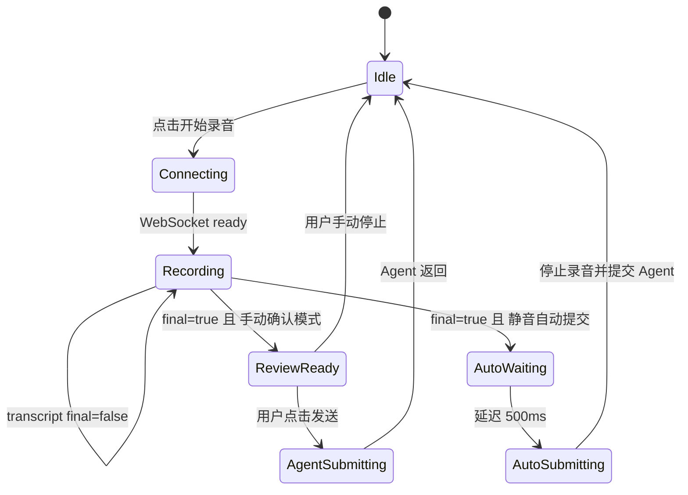

# 语音识别模式技术方案

## 背景

当前项目已经接入 DashScope `fun-asr-realtime`，整体链路是：

```text
浏览器麦克风
-> 前端 AudioWorklet 采集 PCM
-> 前端 WebSocket 发送音频帧
-> Spring Boot WebSocket 接收音频帧
-> 后端转发给 DashScope fun-asr-realtime
-> 后端解析识别结果
-> 前端展示实时文本
-> 前端手动发送文本给 Agent
```

现在要在语音识别层增加两种模式：

- 审查模式：保留现有流程，用户手动停止录音，可以修改识别文本，再手动发送给 Agent。
- 自动模式：用户说完后，如果超过一定时间没有继续说话，系统自动停止录音，并自动把识别文本发送给 Agent。

注意：这里的“语音识别模式”和“Agent 执行模式”是两个独立维度。

## 设计目标

1. 复用当前 `fun-asr-realtime` 实时识别链路，不额外引入本地 VAD 模型。
2. 通过 DashScope 返回的句子结束信号判断用户是否说完。
3. 前端新增语音识别模式切换，不影响已有 Agent 自动模式和稳妥模式。
4. 自动模式下减少用户操作，让“说一句话创建日程”更顺滑。
5. 审查模式下保留人工编辑能力，适合识别不准或高风险操作。

## 模式关系

语音识别模式解决的是“语音文本什么时候提交给 Agent”。

Agent 执行模式解决的是“Agent 收到文本后如何执行日程操作”。

两者互相独立，可以自由组合：

| 语音识别模式 | Agent 执行模式 | 效果 |
|---|---|---|
| 审查模式 | 稳妥模式 | 手动确认语音文本，Agent 由后端审查后执行 |
| 审查模式 | 自动模式 | 手动确认语音文本，Agent 可以直接 Tool Calling |
| 自动模式 | 稳妥模式 | 说完自动提交，Agent 由后端审查后执行 |
| 自动模式 | 自动模式 | 说完自动提交，Agent 可以直接 Tool Calling |

默认建议：

- 语音识别模式默认使用审查模式。
- Agent 执行模式默认使用稳妥模式。
- 演示快速链路时，可以选择“语音自动模式 + Agent 稳妥模式”。

## fun-asr-realtime 能力

`fun-asr-realtime` 支持实时流式识别，前端持续发送音频帧，服务端持续返回中间结果和最终结果。

和本需求相关的能力：

| 能力 | 作用 | 项目中的用法 |
|---|---|---|
| 双向流式识别 | 边说边识别，降低等待时间 | 前端持续发送 PCM 帧，后端转发给 DashScope |
| `isSentenceEnd` / `sentence_end` | 表示一句话已经结束 | 后端转成 `final: true` 推给前端 |
| `max_sentence_silence` | 设置静音多久后算一句话结束 | 后端启动识别任务时传入 |
| VAD 断句 | 基于静音判断是否说完 | 自动模式的核心判断依据 |

阿里云文档说明：`fun-asr-realtime` 支持 16kHz 采样率；流式调用建议每次发送约 100ms 音频；`max_sentence_silence` 默认 1300ms，范围是 200ms 到 6000ms，仅在 VAD 断句模式下生效。

参考文档：

- https://help.aliyun.com/zh/model-studio/fun-asr-realtime-java-sdk

## 当前代码基础

后端当前已经做了关键转换：

```text
DashScope sentence.sentence_end
-> 后端解析为 sentenceEnd
-> WebSocket 推送给前端 { type: "transcript", text: "...", final: true }
```

也就是说，自动模式不需要从零开始实现 VAD。我们只需要让前端在收到 `final: true` 后，根据当前语音识别模式决定是否自动停止和自动提交。

当前相关文件：

| 文件 | 职责 |
|---|---|
| `frontend/src/App.vue` | 录音按钮、WebSocket 连接、语音文本展示、提交 Agent |
| `frontend/public/pcm-worklet.js` | 音频采集、重采样、PCM 帧输出 |
| `backend/src/main/java/com/cyx/backend/service/SpeechRecognitionSession.java` | 连接 DashScope、转发音频帧、解析识别结果 |
| `backend/src/main/java/com/cyx/backend/config/SpeechRecognitionProperties.java` | 语音识别配置项 |
| `backend/src/main/resources/application.properties` | 默认语音识别配置 |

## 模式定义

### 审查模式

审查模式是当前已有流程。

流程：

```text
用户点击麦克风
-> 开始录音
-> 前端实时展示识别文本
-> 用户手动点击停止录音
-> 用户检查或修改文本框内容
-> 用户点击发送给 Agent
-> Agent 按当前选择的 Agent 执行模式处理
```

适用场景：

- 用户环境比较嘈杂。
- 语音识别结果可能需要人工修正。
- 删除、修改等高风险日程操作。
- 用户希望明确控制什么时候提交。

### 自动模式

自动模式新增逻辑。

流程：

```text
用户点击麦克风
-> 开始录音
-> 前端实时展示识别文本
-> DashScope 判断静音超过阈值
-> 后端收到 sentence_end=true
-> 后端推送 final=true 给前端
-> 前端锁定最终文本
-> 前端自动停止录音
-> 前端自动调用 /api/agent/chat
-> Agent 按当前选择的 Agent 执行模式处理
```

适用场景：

- 快速添加日程。
- 演示“语音一句话完成操作”的核心能力。
- 用户表达清晰，例如“今天下午三点开会”。

## 推荐交互设计

语音弹窗中建议保留两个独立的模式区域：

```text
语音识别模式：
[审查模式] [自动模式]

Agent 执行模式：
[稳妥模式] [自动模式]
```

不要把四种组合揉成一个大模式，否则用户会混淆。

文案建议：

| 模式 | 按钮文案 | 状态提示 |
|---|---|---|
| 语音审查模式 | 手动确认 | 停止后可修改文本，再发送给 Agent |
| 语音自动模式 | 静音自动提交 | 说完后自动停止并发送给 Agent |
| Agent 稳妥模式 | 稳妥模式 | 后端审查后执行，修改和删除需要确认 |
| Agent 自动模式 | 自动模式 | 模型可直接调用日程工具 |

自动模式下，文本框仍然显示识别内容，但在自动提交过程中应禁用编辑和重复提交按钮，避免出现重复请求。

## 前端实现方案

### 新增状态

在 `frontend/src/App.vue` 中新增语音识别模式状态：

```ts
type SpeechSubmitMode = 'manual' | 'auto'

const speechSubmitMode = ref<SpeechSubmitMode>('manual')
const voiceAutoSubmitting = ref(false)
let voiceAutoSubmitTimer: number | undefined
let voiceAutoSubmitTriggered = false
```

状态含义：

| 状态 | 作用 |
|---|---|
| `speechSubmitMode` | 当前语音识别提交模式 |
| `voiceAutoSubmitting` | 自动提交过程中禁用按钮和输入 |
| `voiceAutoSubmitTimer` | 收到最终结果后延迟提交，避免文本还没稳定 |
| `voiceAutoSubmitTriggered` | 防止一次录音多次自动提交 |

### 处理 final=true

现有前端已经接收：

```ts
updateVoiceText(data.text, Boolean(data.final))
```

需要改成：

```text
收到 transcript
-> 更新文本
-> 如果 final=true 且 speechSubmitMode=auto
-> 触发 scheduleVoiceAutoSubmit()
```

推荐自动提交延迟：

```text
500ms 到 800ms
```

原因：

- 给前端一次机会合并最终文本。
- 避免 DashScope 刚推送最终句子时，后续状态消息还没到。
- 用户体验上不会明显变慢。

### 自动提交逻辑

推荐逻辑：

```text
scheduleVoiceAutoSubmit()
-> 如果已经触发过，直接返回
-> 如果文本为空，直接返回
-> 标记 voiceAutoSubmitTriggered=true
-> setTimeout 500ms
-> stopVoiceRecognition()
-> submitVoiceToAgent()
```

注意点：

1. `stopVoiceRecognition()` 会向后端发送 `stop`，后端再向 DashScope 发送 `finish-task`。
2. `submitVoiceToAgent()` 使用当前选择的 Agent 执行模式，不要在语音自动模式里强行改 Agent 模式。
3. 用户手动关闭弹窗或停止录音时，需要清理 `voiceAutoSubmitTimer`。
4. 录音重新开始时，需要重置 `voiceAutoSubmitTriggered=false`。

### 前端状态机



## 后端实现方案

后端主要做两件事：

1. 支持配置 `max_sentence_silence`。
2. 确保 DashScope 的 `sentence_end` 正确传给前端。

### 新增配置项

在 `SpeechRecognitionProperties` 中新增：

```java
private Integer maxSentenceSilence = 1300;
private Boolean semanticPunctuationEnabled = false;
```

在 `application.properties` 中新增：

```properties
voice-calendar.speech.max-sentence-silence=1300
voice-calendar.speech.semantic-punctuation-enabled=false
```

建议默认值：

| 配置 | 建议值 | 原因 |
|---|---|---|
| `max-sentence-silence` | `1000` 到 `1300` | 适合语音助手交互，停顿一秒左右就可提交 |
| `semantic-punctuation-enabled` | `false` | 使用 VAD 断句，延迟更低 |

如果用户经常说话中间停顿，可以调大到 `1500` 或 `2000`。

### run-task 参数

当前后端构造 DashScope `run-task` 时只传：

```json
{
  "format": "pcm",
  "sample_rate": 16000
}
```

建议改成：

```json
{
  "format": "pcm",
  "sample_rate": 16000,
  "semantic_punctuation_enabled": false,
  "max_sentence_silence": 1300
}
```

这样自动模式和审查模式都会收到同样的最终句子信号，只是前端根据模式决定是否自动提交。

### WebSocket 消息结构

后端推给前端的 transcript 消息保持不变：

```json
{
  "type": "transcript",
  "text": "今天下午三点开会",
  "final": true
}
```

可以选择性增加字段：

```json
{
  "type": "transcript",
  "text": "今天下午三点开会",
  "final": true,
  "sentenceEnd": true
}
```

但为了减少改动，前端直接继续使用 `final` 即可。

## 异常处理

### final=true 但文本为空

处理方式：

```text
不自动提交
提示：没有识别到有效语音内容
保持弹窗打开
```

### 用户没说完但被自动提交

优化方式：

- 将 `max_sentence_silence` 从 `1000` 调到 `1500` 或 `2000`。
- 前端收到 `final=true` 后延迟 `500ms` 到 `800ms` 再提交。
- 后续可以增加“自动提交倒计时取消”按钮。

### 用户说了多句话

当前建议第一阶段只处理一句话：

```text
收到第一个 final=true
-> 自动提交
```

如果后续想支持连续语音命令，可以改成：

```text
持续收集多个 final 句子
-> 超过总静音阈值或用户停顿更久
-> 合并文本后提交
```

但这会增加状态复杂度，当前项目暂不优先。

### 自动提交重复触发

必须使用 `voiceAutoSubmitTriggered` 防重。

触发自动提交后：

```text
voiceAutoSubmitTriggered = true
```

直到下一次开始录音才重置。

### Agent 返回需要确认

这由 Agent 执行模式决定，语音识别模式不特殊处理。

例如：

```text
语音自动模式 + Agent 稳妥模式
```

如果用户说“删除下午三点的会议”，前端会自动把文本发给 Agent，但 Agent 稳妥模式仍然可以返回确认按钮，用户需要再次点击确认。

## 实施步骤

### 第一步：后端补齐静音阈值配置

改动文件：

```text
backend/src/main/java/com/cyx/backend/config/SpeechRecognitionProperties.java
backend/src/main/java/com/cyx/backend/service/SpeechRecognitionSession.java
backend/src/main/resources/application.properties
```

内容：

- 增加 `maxSentenceSilence` 配置。
- 增加 `semanticPunctuationEnabled` 配置。
- `buildRunTaskMessage()` 中把配置传给 DashScope。

### 第二步：前端增加语音识别模式开关

改动文件：

```text
frontend/src/App.vue
frontend/src/style.css
```

内容：

- 新增 `speechSubmitMode` 状态。
- 在语音弹窗中新增“手动确认 / 静音自动提交”切换。
- 保留现有 Agent 模式切换。
- 两个模式区域视觉上分开。

### 第三步：前端实现自动提交

改动文件：

```text
frontend/src/App.vue
```

内容：

- 在 `handleSpeechMessage()` 中判断 `data.final`。
- 在自动语音模式下触发 `scheduleVoiceAutoSubmit()`。
- 自动停止录音并调用 `submitVoiceToAgent()`。
- 增加防重复提交和定时器清理。

### 第四步：验证链路

验证场景：

| 场景 | 预期 |
|---|---|
| 审查模式说“今天下午三点开会” | 文本展示出来，不自动发送 |
| 审查模式手动修改文本后发送 | Agent 按修改后的文本执行 |
| 自动模式说“今天下午三点开会” | 停顿后自动停止录音并发送 Agent |
| 自动模式说空内容 | 不提交，显示提示 |
| 自动模式连续收到多个 final | 只提交一次 |
| 语音自动模式 + Agent 稳妥模式删除日程 | 自动发送文本，但删除仍需确认 |
| 语音自动模式 + Agent 自动模式添加日程 | 自动发送文本，Agent 可直接执行工具 |

## 测试建议

后端测试：

```text
mvn test
```

重点验证：

- `SpeechRecognitionProperties` 能正确读取 `max-sentence-silence`。
- `SpeechRecognitionSession` 构造的 `run-task` 参数包含 `max_sentence_silence`。
- 原有 WebSocket 鉴权逻辑不受影响。

前端测试：

```text
npm run build
```

浏览器验证：

```text
登录 demo 用户
打开语音弹窗
切换语音识别模式
点击录音
说一句“今天下午三点开会”
等待停顿
观察是否自动发送给 Agent
```

## 后续优化

可以后续再做的增强：

1. 自动提交前显示 1 秒倒计时，允许用户取消。
2. 增加最大录音时长，避免用户忘记停止导致持续消耗额度。
3. 增加静音阈值 UI 配置，方便演示时根据环境调节。
4. 支持连续多句合并后提交，例如“明天三点开会，地点在办公室，提前十分钟提醒我”。
5. 如果服务端 VAD 在嘈杂环境下不稳定，再考虑引入前端本地 VAD。

## 当前推荐方案

第一版不要引入额外 VAD 模型，直接使用 `fun-asr-realtime` 的 VAD 断句能力。

推荐组合：

```text
语音识别：自动模式
Agent 执行：稳妥模式
max_sentence_silence：1300ms
前端自动提交延迟：500ms
```

这样既能展示“说完自动操作”的效果，又不会让删除、修改等高风险操作完全失控。
